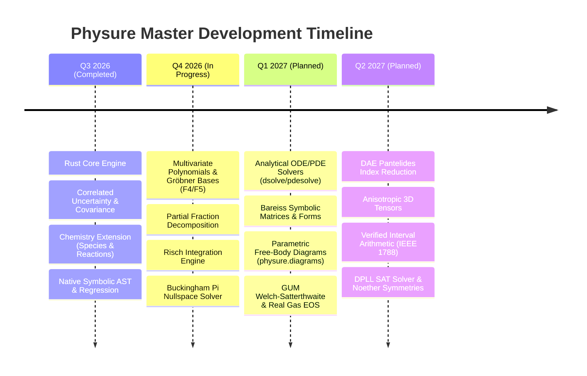

# 🗺️ Physure Master Development Roadmap

**Central Status & Subsystem Progress Tracker**

Physure is a zero-dependency, unit-aware, dimension-correct scientific computing ecosystem built on a high-performance Rust core (`physure_core`) with multi-language bindings (Python, C, Java, WebAssembly) and standalone DSL (`phs`).

This document serves as the **single source of truth** for tracking project-wide progress, sub-roadmaps, subsystem milestones, and architectural goals across the entire workspace.

---

## 📊 Master Subsystem Progress Dashboard

| Subsystem / Sub-roadmap | Status | Progress | Target Path / Sub-roadmap Document | Key Modules |
|---|---|---|---|---|
| **1. Core Physics & Unit Engine** | ✅ Complete | 100% | `physure_core/src/`, `physure/domain/measurement/` | Base units, dimensions, quantities, JIT/AOT |
| **2. Uncertainty & Covariance Engine** | ✅ Complete | 95% | `physure_core/src/uncertainty/`, `physure/domain/uncertainty/` | GUM covariance, Monte Carlo, affine arithmetic |
| **3. Chemistry & Reaction Tracking** | 🚧 Python ✅ / Rust+PHS Planned | 50% | [Chemistry Roadmap](chemistry_roadmap.md) | `physure.ext.chemistry` → `physure_core::chemistry` + PHS builtins |
| **4. Symbolic Math & CAS Engine** | 🚧 Phase 1 Done / Phase 2–4 In Progress | 35% | [Symbolic Math Roadmap](symbolic_math_roadmap.md) | `physure_core::cas`, Gröbner, Risch, ODEs, SAT |
| **5. Diagramming Engine (`physure.diagrams`)**| 📋 Planned | 10% | [Diagramming Engine Roadmap](diagrams_roadmap.md) | Free-body diagrams, vectors, circuits, TikZ/SVG |
| **6. Scientific Companion & Metrology** | 🚧 In Progress | 40% | [Scientific Companion Roadmap](scientific_roadmap.md) | Buckingham $\pi$, IAPWS-IF97, EKF, Polars/Xarray |
| **7. Metrological Rigor & Physical Reality Gaps**| 📋 Planned | 15% | [Scientific Gaps & Rigor](scientific_gaps_and_rigor.md) | Welch-Satterthwaite, DAEs, Real EOS, Intervals |

---

## 🗺️ Sub-Roadmap Registry

> 🧭 **Active execution plan:** [Implementation Plan — Chemistry Core Port, then CAS Phase 2](implementation_plan.md). The sub-roadmaps below define *what* and *why*; that document defines *how* and *in what order*.

For detailed architectural designs, mathematical specifications, API proposals, and paper citations for each domain, consult the dedicated sub-roadmaps:

1. 🧮 **[Symbolic Math & Advanced CAS Engine Roadmap](symbolic_math_roadmap.md)**
   * Multivariate polynomials, Gröbner bases ($F_4/F_5$), Partial fraction decomposition, Taylor/Laurent series, Risch integrator, `dsolve`, `pdesolve`, symbolic linear algebra (Bareiss, Jordan form), number theory, and DPLL SAT solver.
   * Companion research: **[Symbolic Math Scientific Research](symbolic_math_research.md)**.

2. 🧪 **[Chemistry & Physical-Chemical Reaction Tracking Roadmap](chemistry_roadmap.md)**
   * **Phases 1–4** (✅): Chemical formula parsing, IUPAC molar masses, substance-aware mass-to-moles equivalencies, reaction balancing, stoichiometry yield calculator, and thermochemistry/kinetics helpers.
   * **Phases 5–8** (🚧): Rust core chemistry module (`physure_core::chemistry`), PHS DSL native builtins (`species()`, `balance()`, `arrhenius()`), multi-reaction networks with kinetic ODE integration, chemical equilibrium solver (NASA CEA), and cross-language bindings (C/FFI, WASM, JNI).

3. 📐 **[Parametric Physical & Scientific Diagramming Engine Roadmap](diagrams_roadmap.md)**
   * Physically parameter-driven diagramming (`physure.diagrams`), free-body diagrams, particle trajectories with uncertainty cones/ellipses, electrical schematics, field lines, and SVG/TikZ/Matplotlib/ASCII exporters.

4. 🔬 **[Scientific Companion & Metrology Roadmap](scientific_roadmap.md)**
   * Buckingham $\pi$ theorem nullspace solver, GUM uncertainty propagation, IAPWS-IF97 steam tables, Polars/Xarray unit accessories, and unit-aware extended Kalman filters (EKF).

5. ⚖️ **[Scientific Gaps, Metrological Rigor & Reality Analysis](scientific_gaps_and_rigor.md)**
   * GUM Welch-Satterthwaite effective degrees of freedom ($\nu_{\text{eff}}$), Peng-Robinson / IAPWS real gas equations of state, 3D anisotropic tensors (ISO 80000-4), Pantelides DAE index reduction, and IEEE 1788 verified interval arithmetic.

6. 📜 **[Paper Compliance, Validation & Theoretical Reconciliation](paper_compliance_and_validation.md)**
   * Codebase vs. paper compliance matrix, computational limitations, theoretical contradictions resolution (GUM 1st order vs Monte Carlo, Interval vs Affine, Buchberger vs F4/F5), and open `[TODO: Paper Compliance Verification]` registry.

---

## 📅 Consolidated Master Timeline

---

## 🔍 Subsystem Milestone Matrix

### Subsystem 1: Core Physics & Unit Engine (100% ✅)
* [x] Base unit dictionary, prefix system, and SI rational unit vectors in Rust.
* [x] Zero-copy Python bindings via PyO3 (`physure._core.Quantity`).
* [x] `torch.compile` and `jax.jit` zero-overhead tracer compatibility.
* [x] Standalone PHS DSL interpreter (`physure-cli`, `physure-script`).

### Subsystem 2: Chemistry & Physical-Chemistry (50% 🚧)
* [x] **Phase 1–4 Python Extension** (`physure.ext.chemistry`): Species, molar equivalency, reaction balancer, thermo/kinetics.
* [ ] **Phase 5**: Rust core chemistry module (`physure_core::chemistry`) — periodic table `phf::Map`, recursive descent formula parser, Fraction RREF balancer, PyO3 bindings.
* [ ] **Phase 6**: PHS DSL native chemistry builtins — `species()`, `molar_mass()`, `balance()`, `arrhenius()`, `gibbs()`, `mass_to_moles()`, `moles_to_mass()`.
* [ ] **Phase 7**: Advanced reaction networks — multi-reaction stoichiometric matrix, kinetic ODE integration (RK4), chemical equilibrium solver (NASA CEA algorithm).
* [ ] **Phase 8**: Cross-language chemistry bindings — C/FFI (`physure.h`), WebAssembly (`wasm-bindgen`), Java/JNI.

### Subsystem 3: Symbolic Math & CAS Engine (35% 🚧)
* [x] **Phase 1**: Base `Expr` AST, basic simplification, derivatives, heuristic integration, AOT physics compilation, dimensional symbolic regression.
* [ ] **Phase 2**: Multivariate polynomials, Gröbner bases (Buchberger/F4/F5), Hermite partial fraction decomposition, Taylor/Laurent series.
* [ ] **Phase 3**: Risch decision-procedure integrator, analytical ODE solver (`dsolve`), PDE solver (`pdesolve`).
* [ ] **Phase 4**: Symbolic linear algebra (Bareiss fraction-free det, Jordan/Smith canonical forms), number theory, combinatorics, and DPLL SAT solver.

### Subsystem 4: Scientific & Metrological Rigor Gaps (15% 📋)
* [ ] **Welch-Satterthwaite $\nu_{\text{eff}}$**: Effective degrees of freedom and Student-$t$ coverage factor $k_p$ (GUM §4.2).
* [ ] **Real Equations of State**: Peng-Robinson, Redlich-Kwong, and IAPWS-IF97 steam formulation.
* [ ] **Anisotropic Physical Tensors**: 2nd and 4th-order tensors for stress-strain ($\boldsymbol{\sigma}, \boldsymbol{\varepsilon}$) and dielectric permittivity (ISO 80000-4).
* [ ] **Verified Interval Arithmetic**: IEEE 1788 directed interval bounds to prevent floating-point rounding errors.
* [ ] **DAE Pantelides Index Reduction**: Structural index reduction and initialization for coupled physical systems.
* [ ] **Noether Symmetry Derivation**: Symbolic derivation of conserved quantities from Lagrangian/Hamiltonian symmetries.

### Subsystem 5: Parametric Diagramming Engine (`physure.diagrams`) (10% 📋)
* [ ] **Phase 1**: Free Body Diagrams (FBD) on inclined planes, weight/normal/friction force scaling, SVG & Matplotlib renderers.
* [ ] **Phase 2**: Particle kinematics, coordinate transforms, uncertainty error cones, and covariance ellipses.
* [ ] **Phase 3**: Electrical circuit schematics, 2D field line tracing, thermodynamic $P-V$ work integrals.
* [ ] **Phase 4**: Chemistry reaction profiles, VSEPR geometries, and electrochemical cells.
* [ ] **Phase 5**: LaTeX TikZ exporter and terminal ASCII renderer.

---

## 🤝 Maintenance & Updating Guidelines

1. **Central Progress Verification**: When completing a task or PR in any subsystem, update both the target sub-roadmap and this Master Roadmap's progress table.
2. **Relative Linking**: All documentation links MUST remain relative (e.g. `symbolic_math_roadmap.md`) to guarantee portability across GitHub, MkDocs, and local clones.
3. **Paper Citations**: Any new algorithm or physical model added to the roadmap must include peer-reviewed scientific paper citations with public DOI/web links in [`symbolic_math_research.md`](symbolic_math_research.md) or [`scientific_gaps_and_rigor.md`](scientific_gaps_and_rigor.md).
