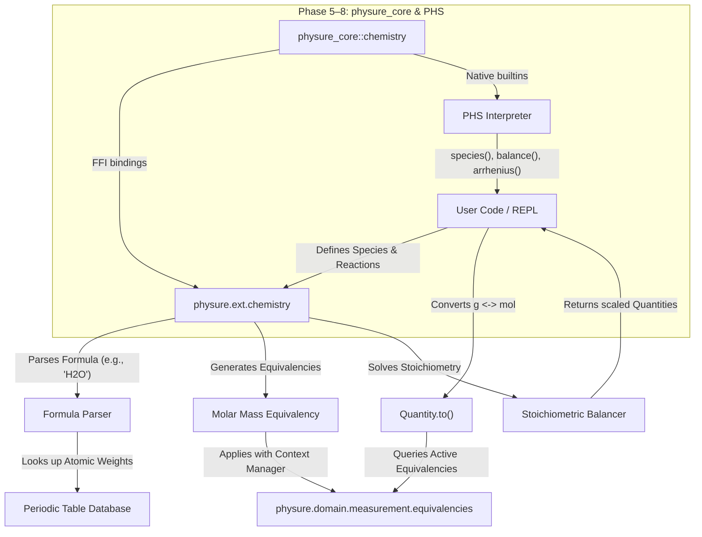
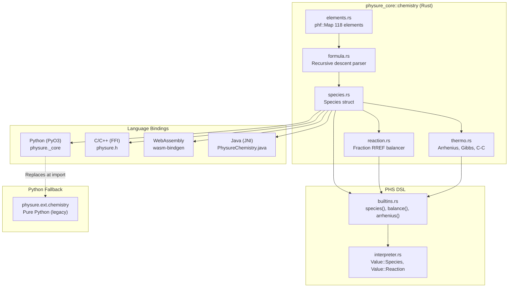

# Chemistry & Physical-Chemical Reaction Tracking Roadmap

**Status: ✅ Python Extension Implemented | 🚧 Phases 5–8 Planned (Rust Core & PHS DSL Integration)**

> 🗺️ **Master Progress Tracker**: This document is a sub-roadmap of the [Master Development Roadmap](ROADMAP.md).

---

A major challenge in chemical unit tracking is **substance dependency**. In physics, `g` and `mol` are incompatible dimensions. In chemistry, they are linked by a species' **molar mass** ($M_W$). 

Rather than modifying the core [Quantity](../physure-python/physure/domain/measurement/quantity.py) class to hold a `species` metadata field (which would pollute the high-performance tensor and JIT compilation paths), we propose a modular architecture utilizing **dynamic equivalencies** and a helper package under `physure/ext/chemistry/`.

### Interaction Diagram



---

## 3. Detailed Subsystem Design

To maintain the **zero runtime dependencies** policy and keep the **first-use import time under 0.5s**, the chemistry subsystem will reside entirely in the `physure/ext/chemistry/` package and be loaded lazily.

### 3.1. Species Representation (`species.py`)
A `Species` object represents a chemical compound or element. It parses chemical formulas, calculates their molar masses, and handles uncertainty (e.g., due to isotopic distribution).

*   **Formula Parser:** A lightweight, pure-Python parser using regular expressions to parse nested chemical formulas:
    *   Examples: `"H2O"`, `"NaCl"`, `"Ca(NO3)2"`, `"Fe3(PO4)2"`.
*   **Periodic Table Database:** A compact dictionary of IUPAC standard atomic weights with experimental uncertainties (e.g., Hydrogen: $1.008 \pm 0.0002\text{ g/mol}$).
*   **Uncertainty Integration:** The molar mass is returned as a `Quantity` with an attached `UncorrelatedUncertainty` or `CorrelatedUncertainty`.

### 3.2. Molar Equivalency (`equivalency.py`)
This ties `Species` to Physure's existing equivalency framework.
*   In SI, the base unit for Mass (`M`) is `kg`, and the base unit for Amount of Substance (`N`) is `mol`.
*   If a substance has a molar mass $M_{\text{base}}$ (in `kg/mol`), the conversion functions are:
    *   $\text{Mass (kg)} \rightarrow \text{Amount (mol)}: n = m / M_{\text{base}}$
    *   $\text{Amount (mol)} \rightarrow \text{Mass (kg)}: m = n \cdot M_{\text{base}}$

```python
def molar_equivalency(species: Species) -> EquivalencyList:
    # Get molar mass in base SI units (kg/mol)
    m_base = species.molar_mass.to("kg/mol").magnitude
    
    from physure.domain.measurement.dimensions import Dimension
    dim_mass = Dimension({"M": 1})
    dim_amount = Dimension({"N": 1})
    
    return [
        (dim_mass, dim_amount, lambda m: m / m_base, lambda n: n * m_base)
    ]
```

### 3.3. Reaction Balancing & Stoichiometry (`reaction.py`)
This represents chemical reactions and performs calculations on reactants and products.
*   **Equation Parsing:** Parses strings like `"2 H2 + O2 -> 2 H2O"`.
*   **Balancer:** Solves the linear system of elemental conservation equations to find the stoichiometric coefficients (stoichiometric matrix kernel). Since external libraries like SciPy or SymPy are optional, we implement a lightweight Gaussian elimination solver in pure Python (falling back to a compiled Rust routine in `physure_core` for complex networks).
*   **Yield & Limiting Reactant Calculations:** Given a set of input reactant `Quantity` objects, it identifies the limiting reactant, calculates the theoretical yield of products, and propagates their uncertainties automatically.

---

## 4. Key API Examples

Here is how the proposed API will look in practice, following the Physure aesthetic:

### 4.1. Substance-Aware Unit Conversion
Converting mass to moles is normally impossible because their dimensions are different. Using the molar equivalency, it becomes trivial:

```python
from physure import Q_, equivalencies
from physure.ext.chemistry import Species, molar_equivalency

# 1. Define species (which automatically computes its molar mass)
water = Species("H2O")  # Molar Mass: 18.01528 +/- 0.0005 g/mol

# 2. Define a mass Quantity
water_mass = Q_(18.015, "g", uncertainty=0.01)

# 3. Convert to moles using equivalencies
with equivalencies(molar_equivalency(water)):
    water_moles = water_mass.to("mol")

print(water_moles)
# Output: 0.99998 +/- 0.00055 mol  (propagates mass scale + molar mass error)
```

### 4.2. Chemical Reactions and Stoichiometric Uncertainty
We can define a reaction, balance it, and calculate product yield with propagated uncertainties from scale measurements.

```python
from physure import Q_
from physure.ext.chemistry import Reaction

# 1. Define and parse a chemical reaction
rxn = Reaction.from_string("2 H2 + O2 -> 2 H2O")

# 2. Define reactant inputs (with lab uncertainties)
h2_input = Q_(10.0, "g", uncertainty=0.1)
o2_input = Q_(50.0, "g", uncertainty=0.2)

# 3. Calculate yields
results = rxn.calculate(H2=h2_input, O2=o2_input)

print(f"Limiting reactant: {results.limiting_reactant}")
print(f"Theoretical water yield: {results.yields['H2O'].to('g')}")
# Output:
# Limiting reactant: O2
# Theoretical water yield: 56.31 +/- 0.23 g
```

### 4.3. Physical-Chemical Interactions: Ideal Gas Law
Since species are associated with molar masses, we can easily cross from chemical quantities to physical quantities like pressure, volume, and temperature:

```python
from physure import Q_
from physure.ext.chemistry import Species

# Ideal Gas: PV = nRT  => P = nRT/V
R = Q_(8.314462618, "J/(mol*K)") # Gas Constant

carbon_dioxide = Species("CO2")
mass = Q_(100.0, "g")
temp = Q_(25.0, "degC") # Converted to 298.15 K internally
vol = Q_(10.0, "L")

# Convert mass to moles under CO2's equivalency
with equivalencies(molar_equivalency(carbon_dioxide)):
    moles = mass.to("mol")

# Physical pressure calculation
pressure = (moles * R * temp.to("K")) / vol.to("m^3")
print(pressure.to("atm"))
# Output: 5.56 atm (perfectly verified and unit-safe!)
```

### 4.4. Kinetics: Arrhenius Equation
Verifying physical-chemical rate constants:
$$k = A \exp\left(-\frac{E_a}{R T}\right)$$

```python
import math
from physure import Q_

# Frequency factor (first-order reaction: s^-1)
A = Q_(1e13, "s^-1")
# Activation energy (J/mol)
E_a = Q_(75.0, "kJ/mol")
# Universal gas constant (J/(mol*K))
R = Q_(8.314, "J/(mol*K)")
# Temperature (K)
T = Q_(298.15, "K")

# Exponent check:
# (75000 J/mol) / (8.314 J/mol*K * 298.15 K) => Dimensionless
exponent = E_a / (R * T) # Exp evaluates to dimensionless Quantity!

k = A * math.exp(-exponent.magnitude)
print(f"Rate constant: {k}") # 0.72 s^-1
```

---

## 5. Feasibility and Constraints Analysis

| Metric/Constraint | Feasibility Rating | Mitigation Strategy |
| :--- | :--- | :--- |
| **Zero Runtime Dependencies** | 🟢 **100% Feasible** | The atomic weight database, formula parser, and reaction balancer can be written in pure Python using basic math/regex, avoiding external dependencies like `scipy` or `sympy`. |
| **First-Use Import Budget (<0.5s)** | 🟢 **100% Feasible** | Keep the chemistry code inside `physure/ext/chemistry/` and do not import it in `physure/__init__.py`. Users import it explicitly only when doing chemistry. |
| **Uncertainty Propagation** | 🟢 **100% Feasible** | Already supported natively by Physure's `equivalencies` and automatic differentiation. Works out-of-the-box. |
| **Multi-backend / JIT Compilation** | 🟡 **70% Feasible** | Equivalency conversions and chemical functions will compile fine with `torch.compile` / `jax.jit`. However, reaction *balancing* (which requires solving systems of equations) should be done at configuration time, not within dynamic trace loops. |
| **Performance Overhead** | 🟢 **90% Feasible** | Pure Python is fast enough for small chemical reactions. For complex reaction networks (e.g., combustion models), we can implement a Rust solver in `physure_core` as an optional performance boost. |
| **Rust Core Integration** | 🟢 **95% Feasible** | Periodic table is a compile-time `phf::Map`, formula parser is a simple recursive descent, RREF is Fraction-exact — all natural in Rust with zero dependencies. |
| **PHS Grammar Extension** | 🟢 **90% Feasible** | Chemistry builtins (`species()`, `balance()`, `arrhenius()`) follow the existing function-call pattern. Reaction arrow notation requires one new grammar rule (`reaction_expr`) but doesn't conflict with existing operators. |

---

## 6. Phase-by-Phase Implementation Roadmap

### Phases 1–4: Python Extension (✅ Complete)

1.  **Phase 1: Species & Atomic Mass Registry (`ext/chemistry/species.py`)** ✅
    *   Implement IUPAC atomic mass database.
    *   Build chemical formula parser.
    *   Expose `Species` class with molecular weight calculation and uncertainty.
2.  **Phase 2: Molar Equivalency (`ext/chemistry/equivalency.py`)** ✅
    *   Build `molar_equivalency(species)` connecting Mass (`M`) and Substance (`N`) dimensions.
    *   Add tests verifying mass-to-moles conversions with uncertainty propagation.
3.  **Phase 3: Reaction Solver & Stoichiometry (`ext/chemistry/reaction.py`)** ✅
    *   Build reaction parser and Gaussian balancer.
    *   Build yield calculator (handling limiting reactants and stoichiometry).
4.  **Phase 4: Physical Chemistry (`ext/chemistry/thermo_kinetics.py`)** ✅
    *   Introduce enthalpy, entropy, free energy database helpers.
    *   Provide Arrhenius, Clausius-Clapeyron, and solution properties helper functions.

---

### Phase 5: Rust Core Chemistry Module (`physure_core::chemistry`) 🚧

**Goal**: Port the core chemistry data structures and algorithms to Rust for performance, cross-language availability, and native PHS integration.

#### 5.1. Module Structure (`physure-core/src/chemistry/`)

```
physure-core/src/chemistry/
├── mod.rs              # pub mod declarations
├── elements.rs         # IUPAC periodic table (compile-time phf::Map)
├── formula.rs          # Recursive descent formula parser
├── species.rs          # Species struct with molar_mass() -> Quantity
├── reaction.rs         # Reaction balancing (exact Fraction RREF)
├── stoichiometry.rs    # Yield, limiting reactant, extent of reaction
└── thermo.rs           # Arrhenius, Clausius-Clapeyron, Gibbs, standard data
```

#### 5.2. Periodic Table in Rust (`elements.rs`)

A compile-time perfect hash map using [`phf`](https://crates.io/crates/phf) (build-dependency only, no runtime cost):

```rust
use phf::phf_map;

/// IUPAC 2021 standard atomic weights: (mass_g_per_mol, abs_uncertainty).
pub static ATOMIC_WEIGHTS: phf::Map<&'static str, (f64, f64)> = phf_map! {
    "H"  => (1.008, 0.0002),
    "He" => (4.002602, 0.000002),
    "Li" => (6.94, 0.02),
    "C"  => (12.011, 0.001),
    "N"  => (14.007, 0.001),
    "O"  => (15.999, 0.001),
    "Na" => (22.98976928, 0.00000002),
    "Fe" => (55.845, 0.002),
    "Cu" => (63.546, 0.003),
    // ... full 118 elements
};
```

**Rationale**: `phf::Map` generates a perfect hash at compile time ($O(1)$ lookup, zero allocation), matching the Python `dict` semantics but with zero runtime overhead. This is the standard approach in Rust chemistry libraries ([`mendeleev`](https://crates.io/crates/mendeleev)).

> 📄 **Reference**: Meija, J. et al. "Atomic weights of the elements 2013 (IUPAC Technical Report)." *Pure and Applied Chemistry* 88.3 (2016): 265-291. [DOI: 10.1515/pac-2015-0305](https://doi.org/10.1515/pac-2015-0305)

#### 5.3. Formula Parser in Rust (`formula.rs`)

A recursive descent parser replacing the Python regex/stack approach. This handles nested parentheses (`Ca(NO3)2`), hydrates (`CuSO4·5H2O`), and Unicode subscripts (`H₂O`):

```rust
pub struct Composition {
    pub elements: Vec<(String, u32)>,  // Sorted by element symbol
}

impl Composition {
    /// Parses "Ca(NO3)2" -> [("Ca", 1), ("N", 2), ("O", 6)]
    pub fn parse(formula: &str) -> Result<Self, ChemistryError> {
        let normalized = normalize_subscripts(formula);
        let tokens = tokenize(&normalized)?;
        let elements = parse_tokens(&tokens)?;
        Ok(Self { elements })
    }

    /// Molar mass with quadrature uncertainty from IUPAC data.
    pub fn molar_mass(&self) -> (f64, f64) {
        let mut mass = 0.0;
        let mut variance = 0.0;
        for (symbol, count) in &self.elements {
            let (elem_mass, elem_unc) = ATOMIC_WEIGHTS
                .get(symbol.as_str())
                .expect("Unknown element");
            mass += *count as f64 * elem_mass;
            variance += (*count as f64 * elem_unc).powi(2);
        }
        (mass, variance.sqrt())
    }
}
```

**Performance**: The Rust parser avoids regex compilation overhead and processes formulas in a single pass with no heap allocation for simple compounds (stack-based `SmallVec<[(String, u32); 8]>`).

#### 5.4. Species Struct in Rust (`species.rs`)

```rust
use crate::quantity::Quantity;
use crate::units::UnitRegistry;

pub struct Species {
    pub formula: String,
    pub composition: Composition,
}

impl Species {
    pub fn new(formula: &str) -> Result<Self, ChemistryError> {
        let composition = Composition::parse(formula)?;
        Ok(Self { formula: formula.to_owned(), composition })
    }

    /// Returns molar mass as a physure Quantity in g/mol with uncertainty.
    pub fn molar_mass(&self, registry: &UnitRegistry) -> Quantity {
        let (mass, unc) = self.composition.molar_mass();
        Quantity::new(mass, registry.parse_unit("g/mol").unwrap())
            .with_uncertainty(unc)
    }
}
```

#### 5.5. Reaction Balancing in Rust (`reaction.rs`)

Port the Python Fraction-based RREF to Rust using the [`num-rational`](https://crates.io/crates/num-rational) crate (compile-time only, no runtime allocation for small matrices):

```rust
use num_rational::Ratio;
use num_integer::Integer;

pub struct BalancedReaction {
    pub reactants: Vec<(Species, i64)>,   // (species, coefficient)
    pub products: Vec<(Species, i64)>,
    pub reversible: bool,
}

impl BalancedReaction {
    /// Parses "H2 + O2 -> H2O" and solves for smallest positive integer coefficients.
    pub fn from_str(equation: &str) -> Result<Self, ChemistryError> {
        let (reactant_formulas, product_formulas, reversible) = parse_equation(equation)?;
        let coeffs = balance_rref(&reactant_formulas, &product_formulas)?;
        // ... construct BalancedReaction
    }
}
```

**Why exact arithmetic**: Floating-point RREF introduces rounding that can produce incorrect integer coefficients for reactions with large stoichiometric numbers (e.g., combustion of octane: $2 \text{C}_8\text{H}_{18} + 25 \text{O}_2 \to 16 \text{CO}_2 + 18 \text{H}_2\text{O}$). The `Ratio<i64>` type guarantees exact results.

> 📄 **Reference**: Smith, W.R. & Missen, R.W. "Chemical Reaction Stoichiometry (CRS): A Tutorial." *Chemical Engineering Education* 33.1 (1999). Available at [Waterloo](https://uwaterloo.ca/chemical-engineering/sites/default/files/uploads/documents/experiment4-crs_tutorial.pdf).

#### 5.6. PyO3 Bindings

Expose Rust chemistry types to Python, replacing the pure-Python implementations with zero-copy wrappers:

```rust
#[pyclass]
struct PySpecies(Species);

#[pymethods]
impl PySpecies {
    #[new]
    fn new(formula: &str) -> PyResult<Self> {
        Species::new(formula)
            .map(PySpecies)
            .map_err(|e| PyValueError::new_err(e.to_string()))
    }

    #[getter]
    fn molar_mass(&self, py: Python) -> PyResult<PyObject> {
        // Return a physure.Quantity via the existing PyO3 bridge
    }

    #[getter]
    fn composition(&self) -> HashMap<String, u32> {
        self.0.composition.elements.iter()
            .map(|(s, c)| (s.clone(), *c))
            .collect()
    }
}
```

**Migration strategy**: The Python `physure.ext.chemistry.Species` class conditionally imports from the compiled `physure._core` module if available, falling back to the pure-Python implementation:

```python
try:
    from physure._core import PySpecies as Species
except ImportError:
    from physure.ext.chemistry._species_py import Species  # Pure Python fallback
```

---

### Phase 6: PHS DSL Native Chemistry Support 🚧

**Goal**: Make chemistry a first-class citizen in the PHS language, so users can write chemical expressions directly in `.phs` scripts without Python.

#### 6.1. New Chemistry Builtins (`physure-script/src/builtins.rs`)

Register chemistry functions alongside existing math/physics builtins:

| Builtin Function | Signature | Description | Example |
|:---|:---|:---|:---|
| `species(formula)` | `species("H2O") -> Species` | Creates a Species object from a formula string | `water = species("H2O")` |
| `molar_mass(formula)` | `molar_mass("CO2") -> Quantity` | Returns molar mass as Quantity in g/mol with IUPAC uncertainty | `M = molar_mass("NaCl")` |
| `composition(formula)` | `composition("Ca(NO3)2") -> Map` | Returns element→count map | `composition("H2O")` |
| `balance(equation)` | `balance("H2 + O2 -> H2O") -> BalancedReaction` | Balances a reaction and returns coefficients | `rxn = balance("CH4 + O2 -> CO2 + H2O")` |
| `arrhenius(A, Ea, T)` | `arrhenius(A, Ea, T) -> Quantity` | Arrhenius rate constant $k = A \exp(-E_a/RT)$ | `k = arrhenius(1e13 s^-1, 75 kJ/mol, 298.15 K)` |
| `gibbs(dH, T, dS)` | `gibbs(dH, T, dS) -> Quantity` | Gibbs free energy $\Delta G = \Delta H - T \Delta S$ | `dG = gibbs(-285.8 kJ/mol, 298.15 K, -163.2 J/(mol*K))` |
| `clausius_clapeyron(dHvap, T1, P1, T2)` | `clausius_clapeyron(...) -> Quantity` | Clausius-Clapeyron vapor pressure | `P2 = clausius_clapeyron(40.7 kJ/mol, 373.15 K, 1 atm, 363.15 K)` |
| `mass_to_moles(mass, formula)` | `mass_to_moles(18 g, "H2O") -> Quantity` | Converts mass to moles using species' molar mass | `n = mass_to_moles(100 g, "CO2")` |
| `moles_to_mass(mol, formula)` | `moles_to_mass(2 mol, "NaCl") -> Quantity` | Converts moles to mass | `m = moles_to_mass(0.5 mol, "H2O")` |

#### 6.2. PHS Chemistry Usage Examples

```phs
# Species and molar mass
M_water = molar_mass("H2O")           # 18.015 +/- 0.001 g/mol
M_glucose = molar_mass("C6H12O6")     # 180.156 +/- 0.008 g/mol

# Mass-to-moles conversion (unit-safe, uncertainty-propagating)
sample = 50.0 +/- 0.1 g
n_co2 = mass_to_moles(sample, "CO2")  # 1.136 +/- 0.003 mol

# Ideal gas law with chemistry
R = 8.314462618 J/(mol*K)
T = 298.15 K
V = 10.0 L
P = (n_co2 * R * T) / (V => m^3)
P => atm                               # 2.78 atm

# Balance a reaction
rxn = balance("Fe2O3 + C -> Fe + CO2")
# rxn.reactant_coeffs = [2, 3]
# rxn.product_coeffs = [4, 3]

# Arrhenius kinetics
A = 1e13 s^-1
Ea = 75.0 kJ/mol
T_rxn = 350.0 K
k = arrhenius(A, Ea, T_rxn)           # Rate constant in s^-1

# Thermodynamics
dH = -285.8 kJ/mol
dS = -163.2 J/(mol*K)
dG = gibbs(dH, 298.15 K, dS)          # -237.1 kJ/mol
```

#### 6.3. Implementation in the Interpreter

The chemistry builtins are registered in `physure-script/src/builtins.rs` following the existing pattern for `sin()`, `cos()`, `deriv()`, etc.:

```rust
// In register_builtins():
env.register_builtin("species", |args, env| {
    let formula = args[0].as_str()?;
    let species = Species::new(formula)?;
    Ok(Value::Species(species))
});

env.register_builtin("molar_mass", |args, env| {
    let formula = args[0].as_str()?;
    let species = Species::new(formula)?;
    let registry = env.unit_registry();
    Ok(Value::Quantity(species.molar_mass(registry)))
});

env.register_builtin("balance", |args, env| {
    let equation = args[0].as_str()?;
    let reaction = BalancedReaction::from_str(equation)?;
    Ok(Value::Reaction(reaction))
});

env.register_builtin("arrhenius", |args, env| {
    let a = args[0].as_quantity()?;
    let ea = args[1].as_quantity()?;
    let t = args[2].as_quantity()?;
    let r = env.get_constant("molar_gas_constant")?;
    let exponent = (ea / (r * t)).to_dimensionless()?;
    Ok(Value::Quantity(a * (-exponent.magnitude()).exp()))
});
```

#### 6.4. New Value Variant

Extend `physure-script/src/value.rs` with chemistry types:

```rust
pub enum Value {
    Quantity(Quantity),
    Str(String),
    Vec(Vec<Value>),
    // New chemistry variants:
    Species(Species),
    Reaction(BalancedReaction),
}
```

---

### Phase 7: Advanced Reaction Networks & Equilibrium 📋

**Goal**: Support multi-reaction systems, chemical equilibrium calculations, and kinetic ODE integration for complex chemical engineering applications.

#### 7.1. Multi-Reaction Networks

The current balancer handles single reactions with exactly one degree of freedom. Phase 7 extends this to coupled reaction networks with multiple independent reactions (e.g., combustion mechanisms):

```rust
pub struct ReactionNetwork {
    pub reactions: Vec<BalancedReaction>,
    pub species_set: Vec<Species>,
    /// Stoichiometric matrix N: rows = species, cols = reactions
    /// N[i][j] = net stoichiometric coefficient of species i in reaction j
    pub stoichiometric_matrix: Vec<Vec<Ratio<i64>>>,
}

impl ReactionNetwork {
    /// Compute the null space of the overall stoichiometric matrix
    /// to identify conservation laws (e.g., total element conservation).
    pub fn conservation_laws(&self) -> Vec<Vec<Ratio<i64>>> {
        null_space(&self.stoichiometric_matrix)
    }

    /// Integrate reaction rates (dξ/dt) via ODE for kinetic modeling.
    pub fn integrate_kinetics(
        &self,
        initial_concentrations: &[Quantity],
        rate_constants: &[Quantity],
        t_span: (f64, f64),
        dt: f64,
    ) -> Vec<Vec<Quantity>> {
        // Explicit RK4 integration of dc/dt = N * r(c, k)
    }
}
```

> 📄 **Reference**: Kee, R.J., Rupley, F.M. & Miller, J.A. "Chemkin-II: A Fortran Chemical Kinetics Package for the Analysis of Gas-Phase Chemical Kinetics." *Sandia National Labs Report* SAND89-8009 (1989). [DOI: 10.2172/5681118](https://doi.org/10.2172/5681118)

#### 7.2. Chemical Equilibrium Solver

Gibbs energy minimization for multi-species equilibrium:

$$\min_{\mathbf{n}} G(\mathbf{n}) = \sum_i n_i \left[ G_i^{\circ} + RT \ln\left(\frac{n_i}{\sum_j n_j}\right) \right]$$

subject to element conservation constraints $\mathbf{A} \cdot \mathbf{n} = \mathbf{b}$ (where $\mathbf{A}$ is the formula matrix and $\mathbf{b}$ the element totals).

```rust
pub fn equilibrium_composition(
    species: &[Species],
    initial_amounts: &[f64],
    temperature: f64,
    pressure: f64,
    standard_gibbs: &[f64],
) -> Result<Vec<f64>, ChemistryError> {
    // Lagrange multiplier method with Newton-Raphson iteration
    // Following the NASA CEA (Chemical Equilibrium with Applications) algorithm
}
```

> 📄 **Reference**: Gordon, S. & McBride, B.J. "Computer Program for Calculation of Complex Chemical Equilibrium Compositions and Applications." *NASA Reference Publication* 1311 (1994). [NASA Technical Reports](https://ntrs.nasa.gov/citations/19950013764)

#### 7.3. PHS DSL for Reaction Networks

```phs
# Define a reaction network for methane combustion
rxn1 = balance("CH4 + 2 O2 -> CO2 + 2 H2O")
rxn2 = balance("2 CO + O2 -> 2 CO2")
rxn3 = balance("2 H2 + O2 -> 2 H2O")

# Equilibrium calculation (planned)
# eq = equilibrium(["CH4", "O2", "CO2", "H2O", "CO", "H2"], T: 1500 K, P: 1 atm)
```

---

### Phase 8: Cross-Language Chemistry Bindings 📋

**Goal**: Expose `physure_core::chemistry` to all language targets — C/C++ (via FFI), Java (via JNI), and WebAssembly (via `wasm-bindgen`).

#### 8.1. C FFI Header (`physure.h`)

```c
/* Chemistry functions exposed via C FFI */
typedef struct PhysureSpecies PhysureSpecies;

PhysureSpecies* physure_species_new(const char* formula);
double physure_species_molar_mass(const PhysureSpecies* species);
double physure_species_molar_mass_uncertainty(const PhysureSpecies* species);
void physure_species_free(PhysureSpecies* species);

int physure_balance_reaction(
    const char* equation,
    int* reactant_coeffs, size_t* n_reactants,
    int* product_coeffs, size_t* n_products
);
```

#### 8.2. WebAssembly/JavaScript

```javascript
import { species, molarMass, balance } from 'physure-wasm';

const water = species("H2O");
console.log(molarMass("H2O")); // { value: 18.015, uncertainty: 0.001, unit: "g/mol" }

const rxn = balance("Fe2O3 + CO -> Fe + CO2");
console.log(rxn.reactantCoeffs); // [1, 3]
console.log(rxn.productCoeffs);  // [2, 3]
```

#### 8.3. Architecture Diagram



---

## 7. Scientific References

| Topic | Paper / Standard | Link |
|:---|:---|:---|
| IUPAC Atomic Weights 2021 | Meija et al., *Pure Appl. Chem.* 88.3 (2016) | [DOI: 10.1515/pac-2015-0305](https://doi.org/10.1515/pac-2015-0305) |
| Stoichiometric Matrix Methods | Smith & Missen, *Chem. Eng. Edu.* 33.1 (1999) | [Waterloo Tutorial](https://uwaterloo.ca/chemical-engineering/sites/default/files/uploads/documents/experiment4-crs_tutorial.pdf) |
| CHEMKIN-II Kinetics Package | Kee, Rupley & Miller, Sandia SAND89-8009 (1989) | [DOI: 10.2172/5681118](https://doi.org/10.2172/5681118) |
| NASA CEA Equilibrium | Gordon & McBride, NASA RP-1311 (1994) | [NASA TRS](https://ntrs.nasa.gov/citations/19950013764) |
| GUM Uncertainty Propagation | JCGM 100:2008 | [BIPM GUM](https://www.bipm.org/documents/20126/2071204/JCGM_100_2008_E.pdf) |
| Arrhenius Equation | Arrhenius, S. *Z. Phys. Chem.* 4 (1889): 226–248 | [DOI: 10.1515/zpch-1889-0416](https://doi.org/10.1515/zpch-1889-0416) |

