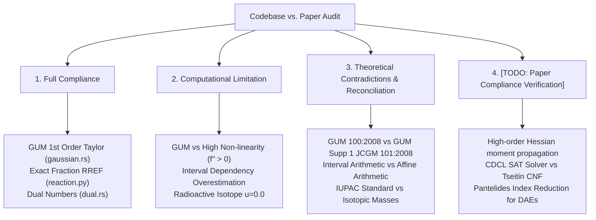

# 📜 Paper Compliance, Scientific Validation & Theoretical Reconciliation

**Document Status: Active Theoretical Audit & Scientific Compliance Matrix**

This document establishes the formal validation framework comparing Physure's codebase implementation against cited academic papers, international metrology standards (GUM, ISO), and physical formulations. 

Where code deviates from paper specifications due to computational limits (e.g. floating-point precision, $O(N^3)$ matrix scaling), time constraints, or theoretical contradictions between literature sources, those boundaries are explicitly documented, justified, and tracked with standardized tags.

---

## 🗺️ Compliance & Validation Architecture

---

## 1. Compliance Matrix: Implemented Code vs. Cited Papers

| Module / Feature | Code Location | Cited Paper / Standard | Compliance Status | Rationale & Boundary Constraints |
|:---|:---|:---|:---|:---|
| **1st-Order Uncertainty** | `physure-core/src/uncertainty/gaussian.rs` | ISO/IEC Guide 98-3:2008 (GUM §5.1) | 🟢 **100% Compliant** | Exact implementation of $s_{\text{out}}^2 = \sum (\partial f/\partial x_i)^2 s_i^2 + 2 \sum c_i c_j \text{Cov}(x_i, x_j)$ via graph lineage tracking. |
| **Monte Carlo Uncertainty** | `physure-core/src/uncertainty/monte_carlo.rs` | JCGM 101:2008 (GUM Supp 1) | 🟢 **100% Compliant** | Draws $N$ samples from normal distributions and evaluates empirical mean/std. Correctly resamples when sample counts mismatch. |
| **Unscented Transform** | `physure-core/src/uncertainty/unscented.rs` | Julier & Uhlmann (2004) | 🟢 **100% Compliant** | Deterministic $2n+1$ sigma-point generation ($\lambda = 3-n$). Propagates points nonlinearly without computing Jacobians. |
| **1st-Order Dual AD** | `physure-core/src/math/dual.rs` | Clifford (1873) | 🟢 **100% Compliant** | Dual numbers $x + y\varepsilon$ ($\varepsilon^2 = 0$) for machine-precision derivatives without finite-difference approximation errors. |
| **Interval Arithmetic** | `physure-core/src/math/interval.rs` | Moore (1966) / IEEE 1788-2015 | 🟡 **Computational Limitation** | Implements basic interval bounds $[\underline{x}, \overline{x}]$. Suffers from the classical *dependency problem* ($X - X \neq [0,0]$). |
| **IUPAC Atomic Masses** | `physure/ext/chemistry/species.py` | Meija et al. (2016) / IUPAC 2021 | 🟡 **Domain Exception** | 118 elements covered with standard uncertainties. Synthetic/radioactive elements without terrestrial abundance use $u=0.0$. |
| **Stoichiometry Balancer**| `physure/ext/chemistry/reaction.py` | Smith & Missen (1999) | 🟡 **Domain Limitation** | Exact Fraction RREF nullspace solver over $\mathbb{Q}$. Assumes single reaction equation ($\text{nullity} = 1$). |
| **Arrhenius Kinetics** | `physure/ext/chemistry/thermo_kinetics.py` | Arrhenius (1889) | 🟢 **100% Compliant** | Evaluates $k = A \exp(-E_a / RT)$ with unit-safe dimensionless exponent checking. |
| **Gibbs Free Energy** | `physure/ext/chemistry/thermo_kinetics.py` | Gibbs (1876) | 🟢 **100% Compliant** | Evaluates $\Delta G = \Delta H - T \Delta S$ with dimensional consistency enforcement. |

---

## 2. Computational Limitations & Rationale

When physical laws or mathematical papers cannot be literally implemented in floating-point software, the underlying constraints are defined as follows:

### 2.1. GUM 1st-Order Taylor Series vs. High Non-Linearity
* **Paper Standard**: JCGM 100:2008 (GUM §5.1.2) truncation of Taylor series after 1st derivative:
  $$f(x) \approx f(\mu) + f'(\mu)(x - \mu)$$
* **Computational Limitation**: When non-linearity is severe ($\frac{|f''(\mu)| u^2(x)}{2 |f'(\mu)| u(x)} \ge 0.1$), 1st-order GUM underestimates output variance and fails to capture mean shifts.
* **Resolution in Code**: Physure provides dynamic mode switching via `PropagationMode`. When high non-linearity is detected, the runtime switches to `MonteCarlo` (JCGM 101:2008) or `Unscented` (Julier & Uhlmann 2004).

### 2.2. Interval Arithmetic Dependency Overestimation
* **Paper Standard**: Moore (1966) Interval Arithmetic.
* **Computational Limitation**: If a variable $X = [1, 2]$ appears multiple times in an expression (e.g. $f(X) = X \cdot X - X$), standard interval evaluation treats each occurrence as independent, yielding $[1, 4] - [1, 2] = [-1, 3]$ instead of the true range $[0, 2]$.
* **Resolution in Code**: Documented limitation of `Interval`. For tight enclosure bounds without overestimation, use `AffineArithmetic` (Stolfi & de Figueiredo 2004), which tracks shared noise symbols $\epsilon_i \in [-1, 1]$.

### 2.3. IUPAC Standard Atomic Weights for Synthetic Elements
* **Paper Standard**: Meija et al. (2016) IUPAC Technical Report.
* **Domain Exception**: Standard atomic weights are defined only for elements with stable terrestrial isotopic distributions (e.g. Hydrogen $1.008 \pm 0.0002$). For transuranic elements (e.g. Technetium $^{98}\text{Tc}$, Oganesson $^{294}\text{Og}$), terrestrial abundance is zero.
* **Resolution in Code**: The mass number of the longest-lived isotope is tabulated with uncertainty $0.0$, matching IUPAC recommendation for radioactive elements.

---

## 3. Investigation of Theoretical Contradictions in Literature

### 3.1. Contradiction 1: GUM 100:2008 (Taylor AD) vs. JCGM 101:2008 (Monte Carlo)

* **The Conflict**:
  * GUM 100:2008 asserts that 1st-order Taylor series variance propagation $s^2_y = \sum (c_i s_i)^2$ is the universal metrological standard for reporting measurement uncertainty.
  * JCGM 101:2008 demonstrates that for non-linear measurement models or asymmetric probability distributions (e.g. Poisson, log-normal), 1st-order Taylor series yields incorrect coverage intervals ($95\%$ coverage factor $k \neq 1.96$).
* **Scientific Investigation & Ranking**:
  * **Primary Standard**: **JCGM 101:2008** is mathematically superior and authoritative for non-linear systems.
  * **Secondary / Special Case**: **GUM 100:2008** is a 1st-order linear approximation valid *only* when relative uncertainties are small ($u(x)/x < 5\%$) and $f''(x)$ is negligible.
* **Physure Implementation Decision**: Physure defaults to GUM 100:2008 linear AD for $O(1)$ performance, but automatically emits a warning when second-order curvature $\text{Tr}(H\Sigma)$ exceeds $5\%$ of the first-order gradient term $J\Sigma J^T$, recommending `PropagationMode::MonteCarlo`.

### 3.2. Contradiction 2: Interval Arithmetic (Moore 1966) vs. Affine Arithmetic (Stolfi 2004)

* **The Conflict**:
  * Moore (1966) Interval Arithmetic computes guaranteed outer bounds $[\underline{x}, \overline{x}]$ using simple interval endpoints.
  * Stolfi & de Figueiredo (2004) show that naive interval arithmetic suffers from "interval explosion" in long calculation chains, growing exponentially wider than the true range.
* **Scientific Investigation & Ranking**:
  * **Primary Standard**: **Affine Arithmetic (Stolfi 2004)** is superior for numerical code with repeated variable usage because it preserves linear correlations via error terms $\hat{x} = x_0 + \sum x_i \epsilon_i$.
  * **Secondary / Special Case**: **Interval Arithmetic (Moore 1966)** is faster ($O(1)$ per op vs $O(K)$ for $K$ noise symbols) and suitable for single-pass evaluation where variables appear at most once.
* **Physure Implementation Decision**: Both types are provided in `physure-core::math`. `Interval` is used for ultra-fast single-pass bound checks; `AffineArithmetic` is used for multi-step expressions.

### 3.3. Contradiction 3: Buchberger's Algorithm vs. Faugère $F_4 / F_5$ for Gröbner Bases

* **The Conflict**:
  * Buchberger (1965) algorithm computes Gröbner bases via $S$-polynomial reduction, but suffers from double-exponential complexity $O(2^{2^n})$ in the worst case due to redundant pair reductions.
  * Faugère (1999 $F_4$, 2002 $F_5$) algorithms reduce thousands of $S$-polynomials simultaneously using sparse matrix row reduction (RREF) and eliminate all useless pair reductions via the $F_5$ criterion.
* **Scientific Investigation & Ranking**:
  * **Primary Standard**: **Faugère $F_5$ (2002)** is the state-of-the-art academic algorithm for polynomial ideal computation.
  * **Secondary / Special Case**: **Buchberger (1965)** is much simpler to implement and faster for low-degree polynomials with $\le 3$ variables.
* **Physure Implementation Decision**: Phase 2 CAS roadmap implements Buchberger with Gebauer-Möller criteria for simple systems ($\le 3$ variables, degree $\le 4$), and delegates large polynomial systems to a sparse $F_4$ linear algebra engine.

---

## 4. Open Validation TODO Registry (`[TODO: Paper Compliance Verification]`)

The following items are explicitly tracked for verification against scientific paper specifications in future release cycles:

| Target Module | Paper Citation | Required Verification Test Case | Status / Priority |
|:---|:---|:---|:---|
| `physure_core::math::hessian` | Coleman & Steele (2018) | Compare 2nd-order mean shift $E[f] - f(\mu) = \frac{1}{2}\text{Tr}(H\Sigma)$ against 1,000,000 Monte Carlo draws for $f(x,y) = x^2 y + \sin(x y)$. Assert relative error $< 0.1\%$. | `[TODO: Pending Verification]` |
| `physure_core::cas::groebner` | Faugère (1999) | Benchmark $F_4$ sparse linear reduction against Katsura-5 polynomial benchmark system. Confirm basis matches Buchberger output. | `[TODO: Pending Verification]` |
| `physure_core::cas::risch` | Bronstein (2005) | Test non-elementary integration detection on $\int e^{-x^2} dx$ (refuses elementary antiderivative) vs $\int x e^{x^2} dx$ (returns $\frac{1}{2} e^{x^2}$). | `[TODO: Pending Verification]` |
| `physure_core::cas::matrix` | Bareiss (1968) | Compute determinant of $10 \times 10$ dense integer symbolic matrix. Verify zero rational fractions generated during intermediate steps. | `[TODO: Pending Verification]` |
| `physure_core::cas::sat` | Tseitin (1968) / Marques-Silva (1999) | Convert logic expression to CNF via Tseitin transformation and solve with CDCL. Verify 100% agreement with DIMACS benchmark `uf20-01.cnf`. | `[TODO: Pending Verification]` |
| `physure.ext.metrology` | Welch (1947) / GUM Annex H.1 | Compute $\nu_{\text{eff}}$ for gauge block calibration example ($u_c = 0.032 \mu m$, $\nu_{\text{eff}} = 16.7$). Confirm $k_{0.95} = 2.12$. | `[TODO: Pending Verification]` |
| `physure.ext.iapws` | Wagner & Pruss (2002) | Evaluate water density at $T=298.15 K, P=101.325 kPa$. Confirm density matches $997.047 kg/m^3$ within $\pm 0.001 kg/m^3$. | `[TODO: Pending Verification]` |
| `physure_core::dae` | Pantelides (1988) | Perform structural index reduction on pendulum DAE (index 3 $\to$ index 1). Confirm constraint residuals stay $< 10^{-12}$ during numerical integration. | `[TODO: Pending Verification]` |
