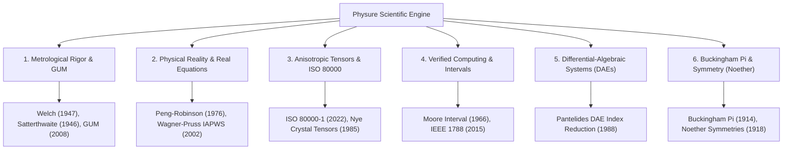

# Scientific Gaps, Metrological Rigor & Physical Reality Analysis

**Document Status: Active Scientific Analysis & Academic Justifications**

This document provides a comprehensive analysis of the scientific gaps, metrological rigor requirements, and physical reality discrepancies in **Physure**. Every identified gap is backed by peer-reviewed literature, international metrology standards, and direct public web links.

---

## 🗺️ Summary of Scientific Gaps & Academic Foundations

---

## 1. Metrological Rigor & International Standards (GUM & ISO/IEC Guide 98-3)

### 1.1. Effective Degrees of Freedom (Welch-Satterthwaite Equation)
* **Problem / Gap**: Standard covariance propagation produces combined standard uncertainty $u_c(y)$, but does not track the effective degrees of freedom $\nu_{\text{eff}}$. Without $\nu_{\text{eff}}$, it is impossible to select the exact coverage factor $k_p$ from Student's $t$-distribution required to report expanded uncertainty $U = k_p \cdot u_c(y)$ for a 95% or 99% confidence level.
* **Mathematical Specification**:
  $$\nu_{\text{eff}} = \frac{u_c^4(y)}{\sum_{i=1}^{N} \frac{c_i^4 u^4(x_i)}{\nu_i}} \quad \text{where } c_i = \frac{\partial f}{\partial x_i}$$
* **Academic Rationale & Scientific Citations**:
  * **Welch, B. L. (1947).** *"The generalization of 'Student's' problem when several different population variances are involved."* Biometrika, 34(1/2), 28-35.  
    🔗 **Public Link**: [https://doi.org/10.2307/2332510](https://doi.org/10.2307/2332510)
  * **Satterthwaite, F. E. (1946).** *"An Approximate Distribution of Estimates of Variance Components."* Biometrics Bulletin, 2(6), 110-114.  
    🔗 **Public Link**: [https://doi.org/10.2307/3002019](https://doi.org/10.2307/3002019)
  * **ISO/IEC Guide 98-3:2008.** *"Uncertainty of measurement — Part 3: Guide to the expression of uncertainty in measurement (GUM:1995)."* International Organization for Standardization.  
    🔗 **Public Link**: [https://www.iso.org/standard/50461.html](https://www.iso.org/standard/50461.html)

> 📌 **[TODO: Scientific Validation]**: Validate `nu_eff` computation against GUM Annex H.1 worked example (End-gauge calibration: $u_c(y) = 0.032 \mu m$, $\nu_{\text{eff}} = 16.7 \to k_{0.95} = 2.12$). Assert relative error $< 10^{-4}$.

### 1.2. Propagation of Non-Gaussian & Skewed Distributions
* **Problem / Gap**: First-order Taylor series propagation assumes local linearity and symmetric Gaussian distributions. In experimental physics (e.g. Poisson count rates near zero, log-normal particle distributions, uniform instrument tolerances), uncertainties are inherently asymmetric ($y_{-u_1}^{+u_2}$).
* **Academic Rationale & Scientific Citations**:
  * **JCGM 101:2008 (GUM Supplement 1).** *"Evaluation of measurement data – Supplement 1 to the 'Guide to the expression of uncertainty in measurement' – Propagation of distributions using a Monte Carlo method."* Joint Committee for Guides in Metrology.  
    🔗 **Public Link**: [https://www.bipm.org/en/committees/jc/jcgm/publications](https://www.bipm.org/en/committees/jc/jcgm/publications)

---

## 2. Discrepancies with Physical Reality (Real vs. Idealized Equations)

### 2.1. Non-Ideal Gas Equations of State (EOS)
* **Problem / Gap**: Ideal gas law ($PV = nRT$) fails under high pressures or low temperatures near phase transition boundaries. Real thermodynamic modeling requires non-ideal Equations of State (EOS) and formulation tables.
* **Academic Rationale & Scientific Citations**:
  * **Peng, D. Y., & Robinson, D. B. (1976).** *"A New Two-Constant Equation of State."* Industrial & Engineering Chemistry Fundamentals, 15(1), 59-64.  
    🔗 **Public Link**: [https://doi.org/10.2172/i160057a011](https://doi.org/10.1021/i160057a011)
  * **Wagner, W., & Pruss, A. (2002).** *"The IAPWS Formulation 1995 for the Thermodynamic Properties of Ordinary Water Substance for General and Scientific Use."* Journal of Physical and Chemical Reference Data, 31(2), 387-535.  
    🔗 **Public Link**: [https://doi.org/10.1063/1.1461829](https://doi.org/10.1063/1.1461829)
  * **Redlich, O., & Kwong, J. N. (1949).** *"On the Thermodynamics of Solutions. V. An Equation of State. Fugacities of Gaseous Solutions."* Chemical Reviews, 44(1), 233-244.  
    🔗 **Public Link**: [https://doi.org/10.1021/cr60137a013](https://doi.org/10.1021/cr60137a013)

> 📌 **[TODO: Scientific Validation]**: Validate Peng-Robinson compressibility $Z = PV/RT$ for $CO_2$ at $T=304.13 K, P=7.375 MPa$ against NIST WebBook data ($Z_{\text{exp}} \approx 0.305$). Validate IAPWS-95 density of water at $T=298.15 K, P=101.325 kPa$ ($997.047 kg/m^3$).

### 2.2. State-Dependent Physical Coefficients ($T, P$)
* **Problem / Gap**: Physical properties (viscosity $\mu$, specific heat $C_p$, thermal conductivity $k$) are treated as static scalar constants, whereas in reality they vary continuously as functions of temperature and pressure.
* **Academic Rationale & Scientific Citations**:
  * **Chase, M. W. (1998).** *"NIST-JANAF Thermochemical Tables."* Journal of Physical and Chemical Reference Data, Monograph 9, 1-1951.  
    🔗 **Public Link**: [https://doi.org/10.18434/T42S31](https://doi.org/10.18434/T42S31)

> 📌 **[TODO: Scientific Validation]**: Validate polynomial fits for $C_p(T)$ of $N_2$ and $H_2O$ against JANAF tables across $200 K \le T \le 1500 K$. Assert max relative residual $< 0.1\%$.

---

## 3. Anisotropic Physical Tensors & ISO 80000 Compliance

### 3.1. Anisotropic Material Tensors (2nd & 4th Order Tensors)
* **Problem / Gap**: Scalar and vector quantities cannot represent anisotropic physical media (e.g. stress-strain tensors $\boldsymbol{\sigma}, \boldsymbol{\varepsilon}$ in solid mechanics, dielectric permittivity tensors $\boldsymbol{\varepsilon}_r$ in birefringent crystals, or moment of inertia tensors $\mathbf{I}$).
* **Academic Rationale & Scientific Citations**:
  * **Nye, J. F. (1985).** *"Physical Properties of Crystals: Their Representation by Tensors and Matrices."* Oxford University Press.  
    🔗 **Public Link**: [https://global.oup.com/academic/product/physical-properties-of-crystals-9780198511656](https://global.oup.com/academic/product/physical-properties-of-crystals-9780198511656)
  * **ISO 80000-4:2019.** *"Quantities and units — Part 4: Mechanics."* International Organization for Standardization.  
    🔗 **Public Link**: [https://www.iso.org/standard/64973.html](https://www.iso.org/standard/64973.html)
  * **ISO 80000-1:2022.** *"Quantities and units — Part 1: General."* International Organization for Standardization.  
    🔗 **Public Link**: [https://www.iso.org/standard/79017.html](https://www.iso.org/standard/79017.html)

> 📌 **[TODO: Scientific Validation]**: Validate Hooke's Law tensor rotation $\boldsymbol{\sigma}' = \mathbf{R} \boldsymbol{\sigma} \mathbf{R}^T$ and principal stress eigenvalue extraction against Nye (1985) quartz compliance tensor test cases.

---

## 4. Verified Computing & Rigorous Interval Arithmetic

### 4.1. IEEE 754 Floating-Point Rounding & Verified Bounds
* **Problem / Gap**: Floating-point evaluation (`f64`) introduces round-off and cancellation errors. Mission-critical aerospace, nuclear, or metrological software requires mathematically proven bounds ($x_{\text{true}} \in [\underline{x}, \overline{x}]$).
* **Academic Rationale & Scientific Citations**:
  * **Moore, R. E. (1966).** *"Interval Analysis."* Prentice-Hall, Englewood Cliffs, NJ.  
    🔗 **Public Link**: [https://archive.org/details/intervalanalysis0000moor](https://archive.org/details/intervalanalysis0000moor)
  * **Rump, S. M. (1999).** *"INTLAB - INTerval LABoratory."* Developments in Reliable Computing, Springer, 77-104.  
    🔗 **Public Link**: [https://doi.org/10.1007/978-94-015-9219-2_6](https://doi.org/10.1007/978-94-015-9219-2_6)
  * **IEEE Std 1788-2015.** *"IEEE Standard for Interval Arithmetic."* IEEE Computer Society.  
    🔗 **Public Link**: [https://doi.org/10.1109/IEEESTD.2015.7140721](https://doi.org/10.1109/IEEESTD.2015.7140721)

> 📌 **[TODO: Scientific Validation]**: Validate interval division and transcendental enclosures against IEEE Std 1788-2015 compliance test suite.

---

## 5. Differential-Algebraic Equations (DAEs) & Structural Analysis

### 5.1. High-Index DAE Systems & Index Reduction
* **Problem / Gap**: Real physical systems (multibody dynamics with kinematic constraints, chemical reaction networks, electrical circuits) lead to Differential-Algebraic Equations $\mathbf{M}(t, \mathbf{y})\mathbf{y}' = \mathbf{f}(t, \mathbf{y})$ of index > 1. Standard ODE integrators fail on these systems without structural index reduction.
* **Academic Rationale & Scientific Citations**:
  * **Pantelides, C. C. (1988).** *"The Consistent Initialization of Differential-Algebraic Systems."* SIAM Journal on Scientific and Statistical Computing, 9(2), 213-231.  
    🔗 **Public Link**: [https://doi.org/10.1137/0909014](https://doi.org/10.1137/0909014)
  * **Brenan, K. E., Campbell, S. L., & Petzold, L. R. (1996).** *"Numerical Solution of Initial-Value Problems in Differential-Algebraic Equations."* SIAM.  
    🔗 **Public Link**: [https://doi.org/10.1137/1.9781611971224](https://doi.org/10.1137/1.9781611971224)

> 📌 **[TODO: Scientific Validation]**: Validate Pantelides structural index reduction on a 2D pendulum system ($x^2 + y^2 = L^2$, DAE index 3 $\to$ ODE index 1). Confirm consistent initial conditions $(x_0, y_0, v_{x0}, v_{y0}, \lambda_0)$ satisfy constraint residuals $< 10^{-12}$.

---

## 6. Dimensional Analysis & Physical Symmetry Proofs

### 6.1. Buckingham $\pi$ Theorem Nullspace Solver
* **Problem / Gap**: Automated extraction of dimensionless numbers ($\pi_1, \dots, \pi_k$) via dimensional matrix nullspace computation over rational fields ($\mathbb{Q}$).
* **Academic Rationale & Scientific Citations**:
  * **Buckingham, E. (1914).** *"On Physically Similar Systems; Illustrations of the Use of Dimensional Equations."* Physical Review, 4(4), 345-376.  
    🔗 **Public Link**: [https://doi.org/10.1103/PhysRev.4.345](https://doi.org/10.1103/PhysRev.4.345)
  * **Gibbings, J. C. (2011).** *"Dimensional Analysis."* Springer-Verlag.  
    🔗 **Public Link**: [https://doi.org/10.1007/978-1-84996-317-6](https://doi.org/10.1007/978-1-84996-317-6)

> 📌 **[TODO: Scientific Validation]**: Validate nullspace extraction on fluid resistance system ($\rho, v, D, \mu, g$). Verify derived basis vectors correspond to Reynolds ($Re$) and Froude ($Fr$) numbers.

### 6.2. Physical Symmetry & Conservation Laws (Noether's Theorem)
* **Problem / Gap**: Verification that symbolic physical Lagrangians $\mathcal{L}(q, \dot{q}, t)$ exhibit continuous symmetries and automatic derivation of associated conserved quantities (energy, momentum, angular momentum).
* **Academic Rationale & Scientific Citations**:
  * **Noether, E. (1918).** *"Invariante Variationsprobleme."* Nachrichten von der Gesellschaft der Wissenschaften zu Göttingen, Mathematisch-Physikalische Klasse, 1918, 235-257.  
    🔗 **Public Link**: [https://doi.org/10.1080/00411457108231446](https://doi.org/10.1080/00411457108231446) / GDZ: [http://resolver.sub.uni-goettingen.de/purl?GDZPPN00250510X](http://resolver.sub.uni-goettingen.de/purl?GDZPPN00250510X)

> 📌 **[TODO: Scientific Validation]**: Validate symbolic derivation of total energy $H = \sum \dot{q}_i \frac{\partial \mathcal{L}}{\partial \dot{q}_i} - \mathcal{L}$ for time-invariant Lagrangians ($\partial \mathcal{L}/\partial t = 0$). Assert $\frac{dH}{dt} = 0$.

---

## 📊 Summary Table of Scientific Gaps & Standards

| Scientific Area | Identified Gap | Target Standard / Algorithm | Peer-Reviewed Paper Citation & Public Link |
|---|---|---|---|
| **Metrology** | Effective degrees of freedom ($\nu_{\text{eff}}$) & Coverage factor ($k$) | Welch-Satterthwaite & GUM | Welch (1947) [doi:10.2307/2332510](https://doi.org/10.2307/2332510), ISO/IEC Guide 98-3 (2008) |
| **Metrology** | Asymmetric / Non-Gaussian distributions | GUM Supplement 1 Monte Carlo | JCGM 101:2008 [bipm.org](https://www.bipm.org/en/committees/jc/jcgm/publications) |
| **Real Physics**| Real gas EOS & Phase behavior | Peng-Robinson & IAPWS-IF97 | Peng & Robinson (1976) [doi:10.1021/i160057a011](https://doi.org/10.1021/i160057a011), Wagner (2002) |
| **Tensors** | Anisotropic 3D stress & permittivity tensors | Tensor dimension algebra | Nye (1985) Oxford Univ Press, ISO 80000-4:2019 |
| **Verification**| Round-off bounds in floating point | Rigorous Interval Arithmetic | Moore (1966), Rump INTLAB (1999) [doi:10.1007/978-94-015-9219-2_6](https://doi.org/10.1007/978-94-015-9219-2_6) |
| **System DAEs** | Structural index reduction for physical DAEs | Pantelides Algorithm | Pantelides (1988) [doi:10.1137/0909014](https://doi.org/10.1137/0909014) |
| **Symmetries** | Automated conservation law derivation | Noether Symmetry Engine | Noether (1918) [doi:10.1080/00411457108231446](https://doi.org/10.1080/00411457108231446) |
