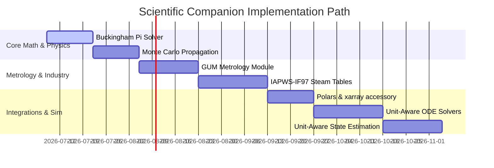

# Scientific Companion Roadmap: Advanced Features for MeasureKit

This document outlines the architectural specifications, API designs, and implementation paths for the advanced mathematical, industrial, and metrological features planned for [MeasureKit](file:///home/irvint/Projects/measurekit/README.md).

---

## 1. Dimensional Analysis & Buckingham $\pi$ Theorem

In physics and industrial engineering, the **Buckingham $\pi$ Theorem** is used to find independent dimensionless groups from a set of physical variables. This is critical for scaling physical systems (e.g., matching Reynolds or Froude numbers to design scale models for wind tunnels).

### 1.1. Core Math & Algorithm
For a set of $n$ physical variables containing $m$ physical dimensions, the Buckingham $\pi$ theorem guarantees there are $k = n - r$ independent dimensionless groups ($\pi$ groups), where $r$ is the rank of the **dimensional matrix** $A$.

$$A = \begin{pmatrix} 
a_{1,1} & a_{1,2} & \cdots & a_{1,n} \\
a_{2,1} & a_{2,2} & \cdots & a_{2,n} \\
\vdots & \vdots & \ddots & \vdots \\
a_{m,1} & a_{m,2} & \cdots & a_{m,n}
\end{pmatrix}$$

where $a_{i,j}$ represents the exponent of the $i$-th base dimension in the $j$-th variable.
We find the dimensionless groups by computing the **null space** (basis of the kernel) of the dimensional matrix $A$:

$$A \cdot \vec{x} = \vec{0}$$

Each vector $\vec{x}$ in the basis corresponds to a dimensionless group $\pi_p = \prod v_j^{x_j}$.

### 1.2. API Design Proposal
```python
from measurekit.ext.physics import buckingham_pi, ScaleModel

# 1. Solve for dimensionless groups
groups = buckingham_pi(
    density="kg/m^3",
    velocity="m/s",
    length="m",
    viscosity="Pa*s",
    gravity="m/s^2"
)

print(groups)
# Output:
# [
#   DimensionlessGroup("density * velocity * length / viscosity"), (Reynolds Number)
#   DimensionlessGroup("velocity^2 / (gravity * length)")          (Froude Number)
# ]

# 2. Design a scale model
# A prototype ship (length=100m, operating in water at velocity=10m/s)
# Scale model (length=2m) matching Froude number
scale = ScaleModel(
    prototype={"length": Q_(100, "m"), "velocity": Q_(10, "m/s")},
    model={"length": Q_(2, "m")}
)

# Solve for required model velocity to maintain physical similarity
model_velocity = scale.solve_for("velocity", matching="Froude")
print(model_velocity.to("m/s"))
# Output: 1.414 m/s
```

---

## 2. Metrology & GUM Compliance (ISO/IEC 17025)

Industrial calibration laboratories require uncertainty calculations compliant with the **Guide to the Expression of Uncertainty in Measurement (GUM)**. This demands distinguishing statistical measurements (Type A) from manufacturer specifications or calibration certificates (Type B).

### 2.1. Mathematical Formulation
*   **Type A Uncertainty ($u_A$):** Calculated as the standard error of the mean from $N$ observations:
    $$u_A = \frac{s}{\sqrt{N}}$$
*   **Type B Uncertainty ($u_B$):** Obtained from non-statistical sources (e.g., manufacturer datasheets). We must convert bounds ($a$) into standard uncertainties using probability distributions:
    *   *Rectangular (Uniform):* $u_B = \frac{a}{\sqrt{3}}$ (assumes equal probability across bounds).
    *   *Triangular:* $u_B = \frac{a}{\sqrt{6}}$ (assumes values are more likely near the center).
*   **Combined Standard Uncertainty ($u_c$):**
    $$u_c = \sqrt{u_A^2 + u_B^2}$$
*   **Expanded Uncertainty ($U$):**
    $$U = k \cdot u_c$$
    where $k$ is the coverage factor (typically $k=2$ for a 95% confidence level).
*   **Degrees of Freedom ($\nu_{\text{eff}}$):** When combining uncertainties with different degrees of freedom, the Welch-Satterthwaite equation is applied:
    $$\nu_{\text{eff}} = \frac{u_c^4}{\sum \frac{u_i^4}{\nu_i}}$$

### 2.2. API Design Proposal
```python
from measurekit.ext.metrology import MetrologyQuantity

# Define a voltage measurement with Type A (statistical) and Type B inputs
v_meas = MetrologyQuantity(
    10.003, "V",
    type_a={"std_dev": 0.002, "n_samples": 10}, # df = 9
    type_b={"tolerance": 0.005, "distribution": "rectangular"} # df = inf
)

print(v_meas.combined_uncertainty) # 0.00295 V
print(v_meas.degrees_of_freedom)    # 29.56 (Welch-Satterthwaite)

# Output expanded uncertainty at 95% confidence
expanded = v_meas.expanded(confidence=0.95)
print(expanded)
# Output: 10.0030 +/- 0.0059 V (k=2.04)
```

---

## 3. Industrial Steam Tables (IAPWS-IF97)

For thermal engineering, chemical plants, and mechanical simulation, property lookups for water and steam must match the industry standard **IAPWS-IF97** formulations.

### 3.1. Interface Design
This module wraps standard IF97 computations, ensuring that input properties are dimensionally correct and output properties are automatically decorated with appropriate physical units.

### 3.2. API Design Proposal
```python
from measurekit import Q_
from measurekit.ext.iapws import WaterState

# Define water state using Temperature and Pressure
state = WaterState(T=Q_(250, "degC"), P=Q_(50, "bar"))

# Extract thermodynamic properties with units
enthalpy = state.enthalpy
entropy = state.entropy
density = state.density

print(enthalpy.to("kJ/kg"))  # Output: 1085.8 kJ/kg
print(entropy.to("kJ/(kg*K)")) # Output: 2.793 kJ/(kg*K)
print(density.to("kg/m^3"))   # Output: 802.5 kg/m^3
```

---

## 4. Polars & xarray Integrations

Scientific datasets are often processed in large tables or multi-dimensional arrays. Preserving units during tabular manipulation is vital for pipeline safety.

### 4.1. Polars Namespace Accessor
We register a custom namespace under `mk` for Polars expressions using its plugin API.

```python
import polars as pl
import measurekit.ext.polars # Registers the 'mk' namespace

df = pl.DataFrame({
    "distance": [10.0, 20.0, 30.0], # units: m
    "time": [2.0, 4.0, 5.0]        # units: s
})

# Calculate speed and convert directly in the query engine
res = df.select([
    (pl.col("distance").mk.quantity("m") / pl.col("time").mk.quantity("s"))
    .mk.to("km/h")
    .alias("speed_kph")
])

print(res)
# Output speed values in km/h directly inside the Polars DataFrame
```

### 4.2. xarray Coordinate/Data Preserver
`xarray` is the standard for climatology and physics arrays. We preserve unit metadata inside the NetCDF-like data structures.

```python
import xarray as xr
import measurekit.ext.xarray

# DataArray wrapped with Quantity units
da = xr.DataArray(
    [10.1, 12.4, 15.8],
    coords=[("time", [1.0, 2.0, 3.0])],
    attrs={"units": "m/s", "uncertainty": 0.1}
)

# Performing operations scales and checks units automatically
acceleration = da.diff("time") / 1.0 # Result automatically decorated with m/s^2
```

---

## 5. Monte Carlo Uncertainty Propagation

For highly non-linear equations, linear (derivative-based) uncertainty propagation underestimates or distorts the true uncertainty. A Monte Carlo propagation draws random samples to build a probability density function of the result.

### 5.1. Integration with Backends
This utilizes PyTorch or JAX to compute thousands of samples in parallel (often GPU-accelerated), returning the empirical mean and standard deviation.

### 5.2. API Design Proposal
```python
from measurekit import Q_, uncertainty_mode

# A highly non-linear relationship: y = exp(A * sin(B) / C^2)
A = Q_(2.0, "s", uncertainty=0.2)
B = Q_(1.5, "rad", uncertainty=0.1)
C = Q_(5.0, "s", uncertainty=0.5)

# Calculate using standard linear propagation
y_linear = torch.exp(A * torch.sin(B) / (C ** 2))
print(f"Linear: {y_linear}")

# Calculate using Monte Carlo propagation
with uncertainty_mode("monte_carlo", samples=500_000, backend="torch"):
    y_mc = torch.exp(A * torch.sin(B) / (C ** 2))
    
print(f"Monte Carlo: {y_mc}")
# Output displays true empirical standard deviation, matching non-linear distortions
```

---

## 6. Unit-Aware Ordinary Differential Equations (ODEs)

In mathematical modeling, physical simulations fail if rate equations are integrated with mismatched units.

### 6.1. Boundary Check & Solving
We wrap standard integration algorithms. Before stepping, the solver checks that:
$$\text{Dimension of } \frac{dy}{dt} = \frac{[y]}{[t]}$$

### 6.2. API Design Proposal
```python
from measurekit import Q_
from measurekit.ext.simulation import solve_ivp_safe

# Define physics variables
g = Q_(9.81, "m/s^2")
drag = Q_(0.2, "kg/m")
mass = Q_(80, "kg")

# ODE function: dv/dt = -g - (drag/mass)*v^2
def falling_body(t: Quantity["s"], v: Quantity["m/s"]) -> Quantity["m/s^2"]:
    # The return value must be in acceleration dimensions
    return -g - (drag / mass) * (v ** 2)

# Safe solver: checks that variables, time boundaries, and equations match
sol = solve_ivp_safe(
    falling_body,
    t_span=(Q_(0, "s"), Q_(10, "s")),
    y0=Q_(0, "m/s")
)

print(sol.y.to("km/h")) # Trajectory results preserved in unit safety
```

---

## 7. Unit-Aware State Estimation & Kalman Filtering

In control engineering, robotics, and aerospace, sensors with heterogeneous units must be fused dynamically. The Extended Kalman Filter (EKF) uses non-linear transition and measurement models, requiring Jacobian matrices to propagate covariances.

### 7.1. Mathematical Formulation

Let the state vector be $\vec{x}$ (e.g., containing position $[L]$, velocity $[L T^{-1}]$, temperature $[\Theta]$).
*   **State Covariance Matrix $P$**: Each element $P_{i,j}$ has the physical dimensions of $[x_i] \cdot [x_j]$.
*   **Jacobian Matrices**: The transition Jacobian $F = \frac{\partial f}{\partial x}$ and measurement Jacobian $H = \frac{\partial h}{\partial x}$ must have elements with dimensions:
    $$[F_{i,j}] = \frac{[f_i]}{[x_j]}, \quad [H_{i,j}] = \frac{[h_i]}{[x_j]}$$
*   **Kalman Gain $K$**: The gain calculation $K = P H^T (H P H^T + R)^{-1}$ is verified to ensure that the units of the correction step $K \vec{y}$ match the state vector $\vec{x}$ exactly:
    $$[K_{i,j}] = \frac{[x_i]}{[y_j]}$$

The symbolic math engine in `measurekit_core` computes these Jacobians analytically, verifying unit consistency across all propagation and update matrices.

### 7.2. API Design Proposal

```python
from measurekit import Q_
from measurekit.ext.control import UnitAwareEKF

# 1. Define non-linear state transition function (projectile with drag)
def projectile_transition(x, u, dt):
    # x = [position (m), velocity (m/s)]
    # u = [acceleration due to thrust (m/s^2)]
    # dt = time step (s)
    drag_coeff = Q_(0.005, "1/m")  # drag parameter
    
    pos_next = x[0] + x[1] * dt
    vel_next = x[1] + (u[0] - drag_coeff * (x[1] ** 2)) * dt
    return [pos_next, vel_next]

# 2. Initialize the EKF (internally generates analytical Jacobians via Rust)
filter = UnitAwareEKF(
    transition_fn=projectile_transition,
    state_units=["m", "m/s"],
    control_units=["m/s^2"]
)

# 3. Predict step with unit covariance propagation
filter.predict(
    control=Q_([12.0], "m/s^2"),
    dt=Q_(0.1, "s"),
    process_noise=Q_([[0.01, 0.0], [0.0, 0.05]], ["m^2", "m^2/s^2"])
)

# 4. Correct step using GPS position measurement
filter.correct(
    measurement=Q_([102.5], "m"),
    measurement_noise=Q_([1.0], "m^2")
)

print(filter.state)  # State remains fully unit-safe and verified!
```

---

## 8. Implementation Roadmap


