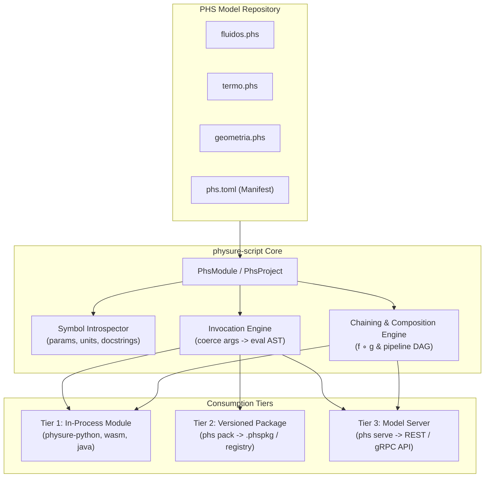

# Direct Foreign Execution Bridge & Mathematical Chaining for PHS Repositories

## 1. Executive Summary

This specification defines the architecture and design for the **Direct Foreign Execution Bridge** in Physure. It enables engineering teams to maintain a repository of `.phs` (PhysureScript) files as an **autodeployable Single Source of Truth (SSOT)** for physical equations, models, and computations. 

Instead of relying solely on Ahead-Of-Time (AOT) transpilation, this bridge provides **direct dynamic invocation**, allowing external runtimes (Python, JavaScript/TypeScript, Java/JVM, and REST/gRPC clients) to load `.phs` files at runtime, introspect function signatures, validate dimensions, execute calculations with rich parameters, and **chain/compose mathematical formulas** with end-to-end unit safety and uncertainty propagation.

---

## 2. Motivation & Requirements

### 2.1 Problem Statement
Currently, integrating `.phs` calculations into external production software requires either:
1. Running code via the CLI / REPL.
2. Transpiling `.phs` scripts to Python, Java, or Rust code via `phs transpile`.

While transpilation is useful for static compilation targets, it creates friction when engineering teams want to rapidly iterate on physics models: any formula update requires re-transpilation, re-bundling, and redeploying host application codebases.

### 2.2 Goals
1. **Autodeployable Formula Repositories**: Engineers push `.phs` files to a repository, and consumers can immediately invoke the updated formulas without modifying client code.
2. **Three Consumption Tiers**:
   - **Tier 1: Dynamic In-Process Module**: Direct loading into memory in Python (`physure.load_phs`, `load_dir`), Node.js, and Java with sub-millisecond execution.
   - **Tier 2: Versioned Package**: Packaging into versioned bundles (`phs.toml`, `phs pack`) for enterprise dependency management and CI/CD pipelines.
   - **Tier 3: Model Server / Microservice**: Containerized engine (`phs serve`) exposing formulas as REST/JSON and gRPC endpoints.
3. **Core Mathematical Capabilities**:
   - Parameter passing with unit coercion (numbers, strings, `Quantity` instances).
   - Dimensional correctness enforcement before evaluation.
   - Exact uncertainty and covariance propagation ($x \pm \sigma$).
   - Symbolic calculus integration (`.deriv()`, `.solve()`).
   - **Mathematical Function Chaining & Composition** ($f \circ g$ and multi-step computational pipelines).

### 2.3 Non-Goals
- Replacing the existing `codegen/` transpiler (AOT transpilation remains an active target for embedded/static environments).
- Adding complex documentation UI or 3D generation to the core bridge (maintains focus strictly on mathematical and execution integrity).

---

## 3. Architecture & System Overview



### Invariants Maintained
- **Zero FFI in `physure-core`**: Core math and units remain purely in Rust with zero foreign dependencies.
- **Single Source of Truth in `physure-script`**: All PHS parsing, signature extraction, function resolution, and AST evaluation reside strictly in `physure-script`.
- **Dimensional Correctness**: Dimension mismatches fail immediately with descriptive errors before arithmetic executes.

---

## 4. Detailed Design: The Core Engine (`physure-script`)

### 4.1 `PhsModule` and `PhsProject`

A `PhsModule` represents a parsed and evaluated PHS script file retaining its symbol table and public function declarations:

```rust
// In physure-script/src/module.rs

#[derive(Clone, Debug)]
pub struct FunctionSignature {
    pub name: String,
    pub docstring: Option<String>,
    pub params: Vec<ParamInfo>,
    pub return_unit: Option<String>,
}

#[derive(Clone, Debug)]
pub struct ParamInfo {
    pub name: String,
    pub expected_unit: Option<String>,
    pub default_value: Option<PhsValue>,
}

pub struct PhsModule {
    pub name: String,
    pub path: Option<PathBuf>,
    pub functions: HashMap<String, FunctionSignature>,
    interpreter: PhsInterpreter,
}

impl PhsModule {
    pub fn from_source(name: &str, source: &str) -> PhysureResult<Self>;
    pub fn from_file(path: impl AsRef<Path>) -> PhysureResult<Self>;
    pub fn invoke(&mut self, fn_name: &str, args: &[PhsValue]) -> PhysureResult<PhsValue>;
    pub fn compose(&self, outer_fn: &str, inner_fn: &str, bind_param: &str) -> PhysureResult<PhsFunction>;
}
```

`PhsProject` manages a directory tree of `.phs` files, tracking cross-file imports and module namespaces (`project.get_module("fluidos")`).

### 4.2 Argument Coercion & Dimensional Validation

When a caller supplies arguments:
1. **String / Quantity coercion**: `"50 mm"` is parsed into a `Quantity` with value $50$ and unit $\text{mm}$.
2. **Dimension validation**: If the function parameter defines `d: m`, the engine verifies that the input unit has dimension $[L]^1$.
3. **Scale conversion**: The magnitude is scaled to the parameter's declared unit before expression evaluation.
4. **Dimension mismatch error**: An invalid unit (e.g. passing seconds to mass) returns an error. There is no `PhysureError::DimensionalMismatch` variant in `physure-core` -- the existing variant for this is `PhysureError::UnitMismatch { expected, actual }` (see `physure-core/src/quantity.rs`'s `convert_to`), or `invoke()` can build its own `PhysureError::Generic` message naming both the parameter and its expected/actual units, as the implementation plan does.

---

## 5. Mathematical Chaining & Composition

### 5.1 Symbolic Composition ($f \circ g$)

When function $g(x)$ produces an output compatible with parameter $y$ of $f(y, z)$, the bridge constructs a new composite function:
$$h(x, z) = f(g(x), z)$$

* **In Rust / `physure-script`**:
  ```rust
  let composite = module_a.compose("fuerza_empuje", "area_tuberia", "area")?;
  ```
* **In Python (`physure-python`)**:
  ```python
  fuerza_directa = hidraulica.fuerza_empuje.compose(geometria.area_tubo, bind_param="area")
  res = fuerza_directa(presion="5 bar", diametro="50 mm")
  ```

### 5.2 Multi-Step Execution Pipelines

For complex engineering workflows spanning multiple `.phs` files, the bridge supports declarative pipelines where intermediate quantities flow with full unit tracking and uncertainty preservation:

```python
# Pipeline chaining in Python
with physure.Pipeline(modelos) as pipe:
    area = pipe.geometria.area_tubo(diametro="50 mm +/- 0.1 mm")
    velocidad = pipe.fluidos.velocidad_flujo(caudal="120 L/min", area=area)
    caida_p = pipe.fluidos.delta_P(velocidad=velocidad, longitud="10 m", viscosidad="1.002 mPa*s")

resultado = pipe.execute()
print(resultado.caida_p) # Exact mean, unit (kPa), and propagated uncertainty (+/- sigma)
```

---

## 6. The Three Consumption Tiers

### 6.1 Tier 1: In-Process Dynamic Module

#### Python (`physure-python`)
* **API Entry Points**:
  - `physure.load_phs(filepath: str | Path) -> PhsModuleProxy`
  - `physure.load_dir(dirpath: str | Path) -> PhsProjectProxy`
* **Features**:
  - Dynamic attribute access (`module.my_function(...)`).
  - Supports keyword arguments matching parameter names.
  - Returns rich `Quantity` objects or primitive values.
  - Inspection support: `dir(module)` and `help(module.my_function)`.

#### WebAssembly (`physure-wasm`) & Java (`physure-java`)
- Exposes `PhsModule.loadFile()` and `PhsModule.call(fnName, args)`.

---

### 6.2 Tier 2: Versioned Package & Distribution

#### Manifest (`phs.toml`)
Located in the root of the engineering repository:

```toml
[package]
name = "enterprise-fluid-models"
version = "1.2.0"
authors = ["Engineering Core Team <eng@company.com>"]
entry = "models/index.phs"

[dependencies]
base_units = "si"

[exports]
fluidos = "models/fluidos.phs"
estructuras = "models/estructuras.phs"
```

#### CLI Packaging
- `phs pack`: Validates all `.phs` syntax, checks internal references, and produces a `.phspkg` bundle.
- `phs test`: Executes all `.test.phs` assertions in the repository.

---

### 6.3 Tier 3: Model Server (REST / gRPC API)

#### Standalone Runner (`phs serve`)
A lightweight HTTP/REST and JSON-RPC server built into `physure-cli` (or a dedicated server subproject):

- **Command**: `phs serve ./models --port 8080 --watch`
- **Hot-Reloading**: Uses filesystem notifications to reload modified `.phs` scripts with zero downtime.
- **Endpoints**:
  - `GET /api/v1/catalog`: Returns all modules, functions, parameters, required units, and docstrings.
  - `POST /api/v1/:module/:function`: Executes a specific function with a JSON dictionary of arguments.
  - `POST /api/v1/pipeline`: Executes an ordered sequence of chained calculations.

#### Sample Request & Response
```http
POST /api/v1/fluidos/delta_P HTTP/1.1
Content-Type: application/json

{
  "caudal": "120 L/min",
  "diametro": "50 mm",
  "longitud": "10 m",
  "viscosidad": "1.002 mPa*s"
}
```

```json
{
  "status": "success",
  "result": {
    "magnitude": 14.852,
    "unit": "kPa",
    "uncertainty": 0.0,
    "dimensions": { "M": 1, "L": -1, "T": -2 }
  }
}
```

---

## 7. Error Handling & Diagnostics

| Failure Scenario | Engine Behavior |
| :--- | :--- |
| **Missing Parameter** | Returns error listing missing required parameters by name. |
| **Dimension Incompatibility** | Rejects call with a dimension-mismatch error before running computation (see §4.2 -- no `DimensionalMismatchError` type exists; this is `PhysureError::UnitMismatch` or a descriptive `PhysureError::Generic`). |
| **Unit Parse Error** | Rejects unparseable string with line/character error offset. |
| **Undefined Function** | Returns `FunctionNotFoundError` with list of available functions in module. |
| **Domain Error ($T < 0\text{ K}$)** | Evaluates guard conditions and returns `PhysicalDomainError`. |

---

## 8. Implementation Roadmap

1. **Phase 1: `physure-script` Core Module & Introspection**
   - Implement `FunctionSignature`, `ParamInfo`, and `PhsModule` in `physure-script`.
   - Add unit coercion and validation in `invoke()`.
   - Add `compose()` and pipeline DAG execution to `physure-script`.
2. **Phase 2: Tier 1 - In-Process Python Dynamic Loader**
   - Expose `PyPhsModule` and `PyPhsProject` in `physure._core` (PyO3).
   - Implement `physure.load_phs()` and `physure.load_dir()` with keyword arg mapping and chaining.
3. **Phase 3: Tier 2 - Packaging & Manifest (`phs pack` / `phs.toml`)**
   - Add manifest parser and `phs pack` command in `physure-cli`.
4. **Phase 4: Tier 3 - Model Server (`phs serve`)**
   - Implement lightweight embedded HTTP server with hot-reloading in `physure-cli`.
   - Add catalog and pipeline execution endpoints.
