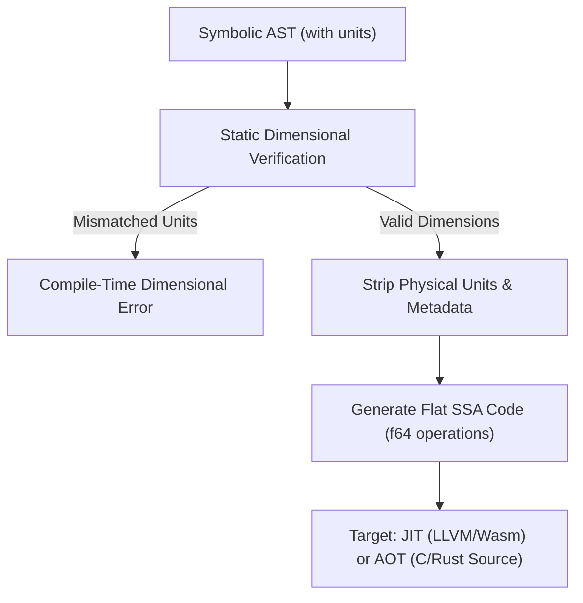

# Symbolic Math & Algebraic Simplification Roadmap

**Status: ✅ Implemented** (PR #30, `main`). This document outlines the architectural justifications, design specifications, algebraic rule-engine, and pattern-matching system required to build a lightweight, high-performance, pure-Rust symbolic mathematics engine inside **`measurekit_core`**.

| Section | Status | Implementation |
|---|---|---|
| §2 AST | ✅ | `measurekit_core/src/symbolic.rs`, `measurekit/domain/symbolic/native.py` |
| §3 Simplification engine | ✅ | `measurekit_core/src/symbolic.rs`, `measurekit/domain/symbolic/native.py` |
| §4.1 Symbolic differentiation | ✅ | `measurekit_core/src/symbolic.rs`, `measurekit/domain/symbolic/native.py` |
| §4.2 Indefinite integration | ✅ | `measurekit_core/src/symbolic.rs`, `measurekit/domain/symbolic/native.py` |
| §5 SymEngine/SymPy-aligned tests | ✅ | `tests/symbolic/test_native_expr.py` (Rust engine + Python fallback) |
| §6 Unit integration | ✅ | `measurekit_core/src/symbolic.rs`, `measurekit/domain/symbolic/native.py` |
| §7 AOT physics compilation | ✅ | `measurekit/ext/compiler.py`, `tests/ext/test_compiler.py` |
| §8 Dimensionally constrained symbolic regression | ✅ | `measurekit/ext/symbolic_regression.py`, `tests/ext/test_symbolic_regression.py` |

The existing sympy-based `SymbolicExpression` (`measurekit/domain/symbolic/expression.py`) is untouched, and none of this engine is wired into `Quantity`/`Dimension` — it is a self-contained engine surfaced under `domain/symbolic/` and `ext/`.

---

## 1. Architectural Justification & Core Benefits

Implementing a native symbolic engine directly in Rust and propagating algebraic control down to the core `Quantity` and `Dimension` representations offers profound benefits across the entire scientific, mathematical, and industrial stack:

### 1.1. Zero-Cost Physical Abstractions
Standard physical unit libraries incur significant runtime performance penalties due to heap allocations and dynamic string parsing (e.g., creating Python objects for every intermediate calculation step). By moving the AST and algebraic simplifications to Rust, we can:
*   Utilize Rust's powerful compile-time evaluation (`const fn` and declarative macros) to resolve unit arithmetic during compilation.
*   Generate zero-overhead machine code where dimensional validation happens at compile time, running at the raw performance of native floating-point numbers (`f64`).

### 1.2. Exact Analytical Uncertainty Propagation
Numerical uncertainty propagation (e.g., using finite differences or numerical derivatives) suffers from truncation and rounding errors, especially near mathematical singularities or zero.
*   By maintaining a symbolic differentiation engine, MeasureKit can compute the **exact analytical formula for the propagated uncertainty** (e.g., deriving $u_{xy} = \sqrt{y^2 u_x^2 + x^2 u_y^2}$ analytically).
*   Evaluating these exact formulas eliminates numerical noise, providing perfect stability for high-precision metrological calculations (GUM compliance).

### 1.3. Static Dimensional Verification of Physical Laws (Type-Checking Physics)
Rather than executing simulations with test values to check if units match, we can perform static analysis on the algebraic expressions themselves.
*   The engine can symbolically prove that two distinct formulas are dimensionally equivalent. For example, verifying that the kinetic energy formula ($\frac{1}{2}m v^2$) matches the work formula ($F \cdot d$), simplifying both to the base dimension vector $[M L^2 T^{-2}]$ (Joules) without evaluating any numbers.

### 1.4. Dimensionless Enforcement on Transcendental Functions
In physics, the arguments of transcendental functions (e.g., $\sin(x)$, $\ln(x)$, $e^x$) must be strictly dimensionless.
*   The algebraic engine enforces this constraint prior to execution. If a user defines an exponent as $e^{k \cdot t}$ (where $t$ is time in seconds), the engine symbolically solves the dimensional equations to verify that $k$ has dimensions of $[s^{-1}]$, simplifying the argument to a dimensionless $1$. If it cannot prove this, it raises a compile-time dimensional error.

### 1.5. Intelligent Dimensional Simplification
In complex thermodynamic or electromagnetic calculations, chained equations often accumulate verbose unit structures (e.g., $\text{kg} \cdot \text{m}^2 \cdot \text{s}^{-3} \cdot \text{A}^{-2} \cdot \text{s}$).
*   With algebraic control, the engine cancels dimensional exponents similarly to symbolic variables, automatically simplifying the complex unit vector into its clean, standard SI derived equivalent (e.g., Ohms $\Omega$).

### 1.6. "Smart" Debugging & Formula Mismatch Diagnostics
When a dimensional mismatch occurs, traditional libraries output generic errors. An algebraic-aware engine can point to the exact sub-expression causing the fault:
> `"IncompatibleUnitsError: Cannot add term (a * t) with unit [m/s] to term (v) with unit [m/s^2] in expression (a * t + v)."`

### 1.7. Portable Physical Model Serialization (Cross-Language Runfiles)
A symbolic AST containing both algebraic expressions and physical units is highly serializable (e.g., to JSON or MathML).
*   A physical control model (e.g., robotic kinematic equations or chemical reactor control loops) can be defined and verified in Python, serialized to a JSON AST, and loaded directly inside a C# Unity game or a WebGL browser client using the exact same compiled Rust engine. This guarantees that physical laws and dimensions are preserved 100% identically across different language runtimes.

---

## 2. Abstract Syntax Tree (AST) Design

To represent mathematical expressions symbolically, we define a recursive `Expr` enumeration in Rust. To ensure seamless physical-chemical integration, the AST is designed to hold both raw symbolic variables and dimensional **MeasureKit Quantities** as leaf nodes.

```rust
#[derive(Debug, Clone, PartialEq)]
pub enum Expr {
    // Leaf Nodes
    Number(f64),
    Symbol(String),
    Quantity(Box<Quantity>), // Direct integration with MeasureKit physical quantities
    
    // Algebraic Operations
    Add(Vec<Expr>),          // Multi-ary addition for commutative simplification
    Mul(Vec<Expr>),          // Multi-ary multiplication for commutative simplification
    Sub(Box<Expr>, Box<Expr>),
    Div(Box<Expr>, Box<Expr>),
    Pow(Box<Expr>, Box<Expr>), // base^exponent
    
    // Transcendental Functions
    Sin(Box<Expr>),
    Cos(Box<Expr>),
    Ln(Box<Expr>),
    Exp(Box<Expr>),
}
```

---

## 3. Algebraic Simplification Engine & Laws

For symbolic expressions to remain human-readable and mathematically minimal, the engine must automatically apply core algebraic laws during construction and AST traversals.

### 3.1. Algebraic Laws to Implement
The Rust engine will implement a recursive `simplify()` function that enforces:
1.  **Identity Laws:**
    *   $x + 0 \rightarrow x$
    *   $x \cdot 1 \rightarrow x$
2.  **Zero/Null Laws:**
    *   $x \cdot 0 \rightarrow 0$
    *   $0^x \rightarrow 0$ (for $x > 0$)
    *   $x^0 \rightarrow 1$
3.  **Inverse Laws:**
    *   $x - x \rightarrow 0$
    *   $x / x \rightarrow 1$ (for $x \neq 0$)
4.  **Commutative & Associative Laws (Flattening):**
    *   $(a + b) + c \rightarrow \text{Add}(a, b, c)$
    *   $(a \cdot b) \cdot c \rightarrow \text{Mul}(a, b, c)$
    *   *Sorting:* Sort symbols alphabetically (e.g., $y \cdot x \rightarrow x \cdot y$) and collect constants to the front (e.g., $x \cdot 3 \cdot y \rightarrow 3 \cdot x \cdot y$) to allow structural comparisons.
5.  **Distributive Law (Expansion):**
    *   $a \cdot (b + c) \rightarrow a \cdot b + a \cdot c$

### 3.2. Pattern Matching and Rule Engine
We use Rust's structural pattern matching to implement an algebraic rewrite system:

```rust
impl Expr {
    pub fn simplify(&self) -> Expr {
        match self {
            Expr::Add(terms) => {
                let mut simplified_terms: Vec<Expr> = terms.iter().map(|t| t.simplify()).collect();
                
                // 1. Flatten nested Add terms (Associativity)
                // 2. Separate and sum numeric constants (Constant Folding)
                // 3. Filter out zeroes (Identity)
                // 4. Collect like terms (e.g., x + x -> 2*x)
                
                // Sort terms to enforce Commutativity
                simplified_terms.sort_by(|a, b| a.canonical_order().cmp(&b.canonical_order()));
                
                if simplified_terms.is_empty() {
                    Expr::Number(0.0)
                } else if simplified_terms.len() == 1 {
                    simplified_terms[0].clone()
                } else {
                    Expr::Add(simplified_terms)
                }
            }
            Expr::Mul(factors) => {
                let mut simplified_factors: Vec<Expr> = factors.iter().map(|f| f.simplify()).collect();
                
                // 1. Check for Zero Law: if any factor is 0.0, return 0.0
                if simplified_factors.iter().any(|f| matches!(f, Expr::Number(0.0))) {
                    return Expr::Number(0.0);
                }
                
                // 2. Flatten nested Mul terms (Associativity)
                // 3. Separate and multiply numeric constants
                // 4. Filter out ones (Identity)
                // 5. Collect powers (e.g., x * x -> x^2)
                
                simplified_factors.sort_by(|a, b| a.canonical_order().cmp(&b.canonical_order()));
                
                if simplified_factors.is_empty() {
                    Expr::Number(1.0)
                } else if simplified_factors.len() == 1 {
                    simplified_factors[0].clone()
                } else {
                    Expr::Mul(simplified_factors)
                }
            }
            Expr::Pow(base, exp) => {
                let b = base.simplify();
                let e = exp.simplify();
                match (b, e) {
                    (_, Expr::Number(0.0)) => Expr::Number(1.0),
                    (base_val, Expr::Number(1.0)) => base_val,
                    (Expr::Number(0.0), _) => Expr::Number(0.0),
                    (Expr::Number(1.0), _) => Expr::Number(1.0),
                    (Expr::Number(num_base), Expr::Number(num_exp)) => Expr::Number(num_base.powf(num_exp)),
                    (base_val, exp_val) => Expr::Pow(Box::new(base_val), Box::new(exp_val)),
                }
            }
            _ => self.clone()
        }
    }
}
```

---

## 4. Symbolic Calculus (Diferencial e Integral)

### 4.1. Symbolic Differentiation
Differentiation is recursively deterministic. The Rust AST traverses down the expression applying standard calculus rules:

*   **Sum Rule:** $(u + v)' \rightarrow u' + v'$
*   **Product Rule:** $(u \cdot v)' \rightarrow u' \cdot v + u \cdot v'$
*   **Quotient Rule:** $(u / v)' \rightarrow \frac{u' \cdot v - u \cdot v'}{v^2}$
*   **Power Rule:** $(u^n)' \rightarrow n \cdot u^{n-1} \cdot u'$ (when $n$ is constant)
*   **Exponential Rule:** $(e^u)' \rightarrow e^u \cdot u'$
*   **Logarithmic Rule:** $(\ln(u))' \rightarrow \frac{u'}{u}$

### 4.2. Indefinite Integration Strategy (Level-1 Solver)
To maintain WebAssembly portability, our Rust engine implements a **Heuristic Rule-Based Integrator** utilizing:
1.  **Direct Pattern Table Lookup:** Resolving basic integrals of variables, polynomials, trigonometric, and simple exponential terms.
2.  **Linear Chain Rule:**
    $$\int f(ax + b) \, dx \rightarrow \frac{1}{a} F(ax + b)$$
    where $F$ is the known antiderivative of $f$.
3.  **Basic $u$-Substitution Heuristic:** Finding if the expression matches $f(g(x)) \cdot g'(x)$ by comparing children of multiplication nodes against computed derivatives of other children.

---

## 5. Test Suite Alignment (SymPy & SymEngine)

To guarantee the mathematical correctness of our Rust engine, we align our test cases with the official test suites of SymPy and SymEngine.

### 5.1. Core Derivative Verification (from `symengine/tests/basic/test_derivative.cpp`)
We translate the C++ core tests into native Rust `#[test]` modules.

```rust
#[cfg(test)]
mod tests {
    use super::*;

    // Derived from symengine test: test_derivative()
    #[test]
    fn test_symengine_derivative_compatibility() {
        let x = Expr::Symbol("x".to_string());
        
        // 1. Derivative of constant: d/dx(5) = 0
        let const_expr = Expr::Number(5.0);
        assert_eq!(const_expr.diff("x").simplify(), Expr::Number(0.0));
        
        // 2. Derivative of self: d/dx(x) = 1
        assert_eq!(x.diff("x").simplify(), Expr::Number(1.0));
        
        // 3. Power rule: d/dx(x^3) = 3 * x^2
        let x_pow_3 = Expr::Pow(Box::new(x.clone()), Box::new(Expr::Number(3.0)));
        let expected_deriv = Expr::Mul(vec![
            Expr::Number(3.0),
            Expr::Pow(Box::new(x.clone()), Box::new(Expr::Number(2.0)))
        ]);
        assert_eq!(x_pow_3.diff("x").simplify(), expected_deriv.simplify());
    }

    // Derived from symengine test: test_trig_derivatives()
    #[test]
    fn test_trig_derivatives() {
        let x = Expr::Symbol("x".to_string());
        
        // d/dx(sin(x)) = cos(x)
        let sin_x = Expr::Sin(Box::new(x.clone()));
        assert_eq!(sin_x.diff("x").simplify(), Expr::Cos(Box::new(x.clone())));
        
        // d/dx(cos(x)) = -1 * sin(x)
        let cos_x = Expr::Cos(Box::new(x.clone()));
        let expected = Expr::Mul(vec![Expr::Number(-1.0), Expr::Sin(Box::new(x.clone()))]);
        assert_eq!(cos_x.diff("x").simplify(), expected.simplify());
    }
}
```

### 5.2. Core Integration Verification (from `sympy/integrals/tests/test_integrals.py`)
We align our indefinite integrals with the test assertions found in SymPy’s integral modules:

```rust
#[cfg(test)]
mod integration_tests {
    use super::*;

    // Derived from SymPy test: test_basic_integration()
    #[test]
    fn test_sympy_basic_integration_compatibility() {
        let x = Expr::Symbol("x".to_string());
        
        // Int( x^2, x ) = x^3 / 3
        let x_sq = Expr::Pow(Box::new(x.clone()), Box::new(Expr::Number(2.0)));
        let expected = Expr::Div(
            Box::new(Expr::Pow(Box::new(x.clone()), Box::new(Expr::Number(3.0)))),
            Box::new(Expr::Number(3.0))
        );
        assert_eq!(x_sq.integrate("x").simplify(), expected.simplify());
        
        // Int( cos(x), x ) = sin(x)
        let cos_x = Expr::Cos(Box::new(x.clone()));
        let expected_trig = Expr::Sin(Box::new(x.clone()));
        assert_eq!(cos_x.integrate("x").simplify(), expected_trig.simplify());
    }
}
```

---

## 6. Integration with Physical Quantities

The major differentiator of our Rust Symbolic Engine is that it is unit-aware. When simplifying or differentiating expressions containing `Expr::Quantity` nodes, the engine validates physical dimensions.

### 6.1. Unit Consistency Checking
Before adding terms, the algebraic engine verifies that they share identical base physical dimensions.
*   $\text{Add}(5\text{ m}, x\text{ m}) \rightarrow \text{Valid}$ (Result is in $\text{Length}$)
*   $\text{Add}(5\text{ m}, y\text{ kg}) \rightarrow \text{Raises IncompatibleUnitsError}$

### 6.2. Auto-propagation of Units in Derivatives
Taking the derivative of a physical quantity automatically updates the physical unit:
$$\frac{d}{d(t\text{ [s]})} (x\text{ [m]}) \rightarrow \text{Result in [m/s]}$$
The unit changes by dividing the dimension of the numerator by the dimension of the differentiation variable.

---

## 7. Ahead-of-Time (AOT) & JIT Physics Compilation

To achieve zero runtime overhead during intensive simulations (such as aerospace trajectory integrations or robotic control loops), the symbolic engine can compile validated physical formulas directly into unit-stripped machine code.

### 7.1. Compilation Pipeline



1. **Static Verification**: The compiler checks all equations and variables.
2. **Unit Stripping**: The physical unit wrappers are completely stripped, mapping the algebraic graph directly to raw float primitives.
3. **Optimizations**: Sub-expression elimination (CSE) and constant folding are applied to the flat SSA (Static Single Assignment) graph.
4. **Target Execution**: The compiler outputs optimized JIT function pointers or C/Rust code.

### 7.2. API Design Proposal

```python
from measurekit import Q_
from measurekit.ext.compiler import compile_physics_model

# 1. Define model physically using symbolic variables
def drag_force(density, velocity, area, drag_coeff):
    # Units are checked dynamically once at compilation time
    return 0.5 * density * (velocity ** 2) * area * drag_coeff

# 2. Compile to raw optimized machine code
fast_drag = compile_physics_model(
    drag_force,
    input_units={
        "density": "kg/m^3",
        "velocity": "m/s",
        "area": "m^2",
        "drag_coeff": ""
    },
    output_unit="N",
    target="llvm"  # Compiles to native assembly pointer via LLVM
)

# 3. High-speed execution loop (runs at native C speed, unit-safety guaranteed)
forces = [fast_drag(1.225, v, 2.5, 0.3) for v in range(1, 1000)]
```

---

## 8. Dimensionally Constrained Symbolic Regression

When fitting experimental data, traditional genetic programming or regression algorithms search a vast space of mathematical combinations, often outputting equations that are physically meaningless (dimensionally inconsistent) or extrapolate poorly.

### 8.1. Space Reduction via Dimensional Filter

By enforcing dimensional homogeneity at each step of the genetic tree synthesis:
1. **Rule Enforcement**: If the algorithm attempts to add terms $A$ and $B$, the engine verifies $[A] == [B]$. If not, the mutation is pruned immediately.
2. **Automatic Constant Synthesis**: If the target output unit is $[Y]$ and the inputs produce $[X]$, the regression engine automatically inserts a scaling constant $k$ with dimensions $[Y] \cdot [X]^{-1}$.
3. **Reduced Search Complexity**: Restricting search trees to dimensionally valid expressions reduces the search space by up to $95\%$, leading to faster convergence on correct physical laws.

### 8.2. API Design Proposal

```python
from measurekit import Q_
from measurekit.ext.symbolic_regression import SymbolicRegressor

# Experimental dataset (with calibration uncertainties)
t = Q_([1.0, 2.0, 3.0, 4.0, 5.0], "s", uncertainty=0.01)
s = Q_([4.9, 19.5, 44.0, 78.3, 122.1], "m", uncertainty=0.5)

# Initialize the regressor with inputs, target output, and allowed mathematical primitives
regressor = SymbolicRegressor(
    inputs={"t": t},
    target=s,
    allowed_operations=["Add", "Mul", "Pow"],
    max_complexity=10
)

# Fit model under dimensional rules
best_fit = regressor.fit()

print(f"Discovered formula: {best_fit.formula_string}")
# Output: "s = 4.898 * t^2"
print(f"Dimension of constant: {best_fit.constants['k'].units}")
# Output: "m/s^2"  (Correct physical dimension of acceleration!)
```
