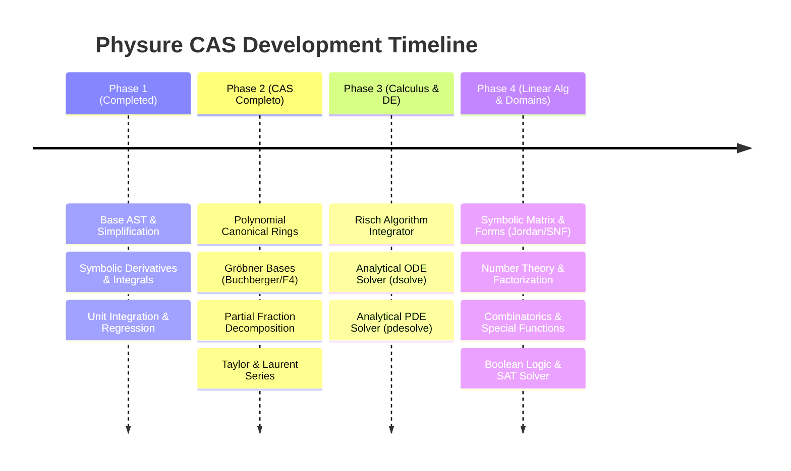

# Symbolic Math & Advanced CAS Engine Roadmap

**Status: Phase 1 Implemented | Phase 2–4 In Progress / Planned**

This document outlines the architectural design, specifications, algebraic algorithms, and implementation path for developing a full-featured, zero-dependency, high-performance **Computer Algebra System (CAS)** and Symbolic Engine inside **`physure_core`** (Rust) with seamless multi-language bindings (Python, C, Java/Wasm).

> 📚 **Academic Rationale & Scientific Literature**: For detailed academic paper citations, algorithmic complexity proofs, and theoretical justifications supporting these choices, see the companion document [Symbolic Math Scientific Research](symbolic_math_research.md).
> 🗺️ **Master Progress Tracker**: This document is a sub-roadmap of the [Master Development Roadmap](ROADMAP.md).

---

## 🗺️ Master Status & Phase Overview

| Phase | Module / Target | Description | Status | Target Path |
|---|---|---|---|---|
| **Phase 1** | **Core Symbolic Engine** | Base AST (`Expr`), basic algebraic simplification, symbolic derivatives, heuristic integrator, unit-aware AST, AOT physics compilation, dimensional symbolic regression. | ✅ Implemented | `physure_core::symbolic`, `physure.domain.symbolic` |
| **Phase 2** | **Full Generalist CAS** | Multivariate polynomial canonical forms, Gröbner bases (Buchberger/F4), Partial Fraction Decomposition (Hermite/Horner), Taylor/Laurent/Puiseux series expansion. | 🚧 Phase 2 Planned | `physure_core::cas::polynomial`, `physure_core::cas::series` |
| **Phase 3** | **Deep Calculus & DE Solver** | Risch algorithm for elementary integration, analytical ODE solver (`dsolve`), PDE separation & characteristic solver (`pdesolve`). | 🚧 Phase 3 Planned | `physure_core::cas::calculus`, `physure_core::cas::de` |
| **Phase 4** | **Linear Algebra & Math Domains** | Symbolic matrices & canonical forms (Jordan, Frobenius, Smith), prime & number theory, combinatorics & special functions, boolean logic & SAT solver. | 🚧 Phase 4 Planned | `physure_core::cas::matrix`, `physure_core::cas::domains` |

---

## 1. Phase 1: Core Symbolic Engine (Completed ✅)

The initial phase established a lightweight, high-performance, pure-Rust symbolic mathematics engine surfaced under `physure_core::symbolic` and Python's `physure.domain.symbolic`.

### 1.1. Core Features Implemented
* **Abstract Syntax Tree (AST)**: Recursive `Expr` enum handling `Number`, `Symbol`, `Quantity`, arithmetic operators (`Add`, `Mul`, `Sub`, `Div`, `Pow`), and transcendental functions (`Sin`, `Cos`, `Ln`, `Exp`).
* **Algebraic Simplification Engine**: Rule-based rewrite system enforcing identity laws, zero laws, inverse laws, associativity/flattening, canonical ordering, and power reductions.
* **Symbolic Differentiation**: Recursive exact derivatives for elementary functions, power rule, product rule, quotient rule, and chain rule.
* **Heuristic Integrator**: Table lookup and basic substitution solver for indefinite integrals.
* **Unit & Dimensional Integration**: Direct unit validation across symbolic sub-expressions, automatic unit propagation during differentiation.
* **AOT Physics Model Compilation**: Compilation of symbolic expressions to optimized SSA code and machine functions with compile-time dimensional stripping.
* **Dimensionally Constrained Symbolic Regression**: Genetic programming search over search spaces constrained by dimensional homogeneity.

---

## 2. Phase 2: Complete & Generalist CAS (CAS Completo y Generalista)

To evolve from an expression simplifier into a full-scale CAS, Physure must support rigorous algebraic structures, canonical polynomial representations, and abstract expression rewriting.

### 2.1. Multivariate Polynomial Simplification & Canonical Ring Operations
* **Polynomial Domain Representation**: Define exact polynomial structures over coefficients in $\mathbb{Z}$, $\mathbb{Q}$, $\mathbb{R}$, $\mathbb{C}$, and finite fields $\mathbb{F}_p$.
* **Monomial Orderings**: Implement standard term orderings:
    * *Lexicographic (Lex)*: Priority on variable order.
    * *Graded Reverse Lexicographic (Grevlex)*: Priority on total degree, breaking ties by lowest power of the last variable (optimal for computational performance).
    * *Graded Lexicographic (Grlex)*.
* **Polynomial Operations & GCD**:
    * Fast polynomial multiplication via Karatsuba and FFT-based algorithms for high degrees.
    * Multivariate polynomial pseudo-division.
    * Polynomial Greatest Common Divisor (GCD) using EZGCD (Enhanced Extended Zassenhaus) and Modular GCD algorithms.
    * Square-Free Factorization (Yun's Algorithm).

### 2.2. Gröbner Bases (`physure_core::cas::groebner`)
Gröbner bases generalize polynomial division, row reduction (Gaussian elimination), and the Euclidean algorithm to multivariate polynomial systems.
* **Buchberger's Algorithm**:
    * Computation of $S$-polynomials:
      $$S(f, g) = \frac{\text{LCM}(\text{LM}(f), \text{LM}(g))}{\text{LT}(f)} \cdot f - \frac{\text{LCM}(\text{LM}(f), \text{LM}(g))}{\text{LT}(g)} \cdot g$$
    * Reductions modulo polynomial sets $F$.
    * Implementation of Gebauer-Möller criteria (Criterion 1 & 2) to eliminate redundant $S$-polynomial pairs.
* **Advanced F4/F5 Matrix-Based Gröbner Engine**:
    * Convert $S$-polynomial reduction into sparse linear matrix reductions over finite fields / rationals for orders of magnitude performance gains.
* **Applications in Physure**:
    * Exact elimination of intermediate symbolic variables in physical constraint systems.
    * Automatic derivation of implicit geometric and kinematic constraints.
    * Solving non-linear polynomial systems symbolically.

### 2.3. Partial Fraction Decomposition (PFD) (`physure_core::cas::rational`)
For rational functions $R(x) = \frac{P(x)}{Q(x)}$:
* **Hermite Reduction**: Separate rational functions into a derivative part and a log-derivative part:
  $$\frac{P(x)}{Q(x)} = \frac{d}{dx} \left( \frac{A(x)}{B(x)} \right) + \frac{C(x)}{D(x)}$$
  where $D(x)$ is square-free.
* **Full Partial Fraction Decomposition**:
    * Factor denominator $Q(x)$ over $\mathbb{R}$ (linear and irreducible quadratic factors) or $\mathbb{C}$ (linear factors).
    * Compute numerators using Heaviside cover-up method and system solving.
* **Applications**: Core engine for symbolic integration of rational functions, Laplace transform inversion, and transfer function analysis in control systems.

### 2.4. Asymptotic & Power Series Expansion (`physure_core::cas::series`)
* **Taylor Series Expansion**:
  $$f(x) = \sum_{n=0}^{N} \frac{f^{(n)}(x_0)}{n!} (x - x_0)^n + \mathcal{O}((x - x_0)^{N+1})$$
    * Symbolic derivation of $n$-th derivatives.
    * Automatic tracking and truncation of asymptotic order terms ($\mathcal{O}(x^N)$).
* **Laurent Series Expansion**:
    * Support expansions around poles where negative powers $(x - x_0)^{-k}$ appear.
    * Computation of residues ($\text{Res}(f, x_0) = a_{-1}$), providing exact path integral evaluation via Cauchy's Residue Theorem.
* **Puiseux Series**:
    * Support fractional exponents $(x - x_0)^{p/q}$ for multi-valued functions and algebraic curves around branch points.

---

## 3. Phase 3: Deep Analytical Calculus & Differential Equations

Calculus capabilities will extend beyond heuristic derivatives into decision-procedure integration and differential equation solving.

### 3.1. Advanced Analytical Integrator (The Risch Algorithm) (`physure_core::cas::risch`)
* **Decision Procedure Integration**:
    * Implement Liouville's Theorem on integration in finite terms: if $\int f \, dx$ is elementary, then $f = y_0 + \sum c_i \frac{y_i'}{y_i}$ for $c_i \in \mathbb{C}$ and $y_i \in K$.
    * Build the **Transcendental Risch Algorithm** for elementary extensions (logarithmic and exponential extensions $K(t)$ where $t = \ln(u)$ or $t = \exp(u)$).
    * Risch-Norman Heuristic (Parallel Risch Algorithm) for rapid antiderivative generation without full differential field tower construction.
* **Definite Integration**:
    * Fundamental Theorem of Calculus with singularity/discontinuity detection (avoiding naive evaluation across poles).
    * Contour integration using residue calculus for infinite limits $\int_{-\infty}^{\infty} f(x) \, dx$.

### 3.2. Ordinary Differential Equations (ODEs - `dsolve`) (`physure_core::cas::ode`)
An analytical solver `dsolve(eq, y(x))` capable of classifying and solving symbolic ODEs:
* **First-Order ODEs**:
    * *Separable equations*: $g(y) dy = f(x) dx$.
    * *Exact equations & Integrating Factors*: $M(x,y)dx + N(x,y)dy = 0$, finding $\mu(x,y)$.
    * *Linear 1st Order*: $y' + P(x)y = Q(x)$ via integrating factor $e^{\int P dx}$.
    * *Bernoulli & Riccati Equations*: Non-linear transformations $v = y^{1-n}$.
    * *Homogeneous ODEs*: $y' = F(y/x)$ using substitution $u = y/x$.
* **Second & Higher-Order Linear ODEs**:
    * *Constant Coefficients*: $a y'' + b y' + c y = f(x)$ via characteristic polynomial root finding ($\lambda^2 + b/a \lambda + c/a = 0$).
    * *Undetermined Coefficients & Variation of Parameters*: For non-homogeneous terms $f(x)$.
    * *Euler-Cauchy Equations*: $x^2 y'' + a x y' + b y = 0$.
    * *Power Series / Frobenius Method*: Solving differential equations around regular singular points (e.g., Bessel, Legendre, Hermite differential equations).
* **Systems of Linear ODEs**:
    * Solving $\mathbf{y}'(t) = \mathbf{A} \mathbf{y}(t) + \mathbf{f}(t)$ via symbolic matrix exponentiation $e^{\mathbf{A} t}$.

### 3.3. Partial Differential Equations (PDEs - `pdesolve`) (`physure_core::cas::pde`)
* **First-Order Quasilinear PDEs**:
    * *Method of Characteristics*: Convert $a(x,y,u) u_x + b(x,y,u) u_y = c(x,y,u)$ into characteristic ODE systems $\frac{dx}{a} = \frac{dy}{b} = \frac{du}{c}$.
* **Second-Order Canonical PDEs**:
    * *Classification*: Elliptic ($B^2 - 4AC < 0$), Parabolic ($B^2 - 4AC = 0$), Hyperbolic ($B^2 - 4AC > 0$).
    * *Separable PDEs*: Separation of variables $u(x,t) = X(x) T(t)$ yielding boundary value eigenvalue problems (Sturm-Liouville problems).
    * *Integral Transform Methods*: Applying symbolic Fourier and Laplace transforms to reduce PDEs to algebraic or ODE forms.
    * Canonical solution builders for Heat Equation ($\frac{\partial u}{\partial t} = k \nabla^2 u$), Wave Equation ($\frac{\partial^2 u}{\partial t^2} = c^2 \nabla^2 u$), and Laplace/Poisson Equations ($\nabla^2 u = f$).

---

## 4. Phase 4: Symbolic Linear Algebra & Mathematical Domains

Mathematical capabilities will span symbolic linear structures and discrete mathematical domains.

### 4.1. Symbolic Linear Algebra (`physure_core::cas::matrix`)
* **Symbolic Matrix AST (`MatrixExpr`)**:
    * Dense and Sparse symbolic matrix representations.
    * Symbolic matrix arithmetic: addition, block multiplication, scalar scaling, transpose, conjugate transpose.
* **Determinant & Inversion Algorithms**:
    * *Bareiss Fraction-Free Algorithm*: Exact determinant calculation over integer/polynomial domains without introducing rational fractions until the final step (avoiding intermediate fraction blowup).
    * *Symbolic Matrix Inversion*: Block inversion, adjugate matrix algorithm ($\mathbf{A}^{-1} = \frac{1}{\det(\mathbf{A})} \text{adj}(\mathbf{A})$).
* **Eigenvalues & Canonical Forms**:
    * *Characteristic Polynomial*: Faddeev-Leverrier algorithm for computing $\det(\lambda \mathbf{I} - \mathbf{A})$ symbolically.
    * *Symbolic Eigenvalues & Eigenvectors*: Exact root finding for polynomials up to degree 4; root isolation for higher degrees.
    * *Canonical Forms*:
        * **Jordan Canonical Form (JCF)**: $\mathbf{J} = \mathbf{P}^{-1} \mathbf{A} \mathbf{P}$.
        * **Rational Canonical Form (Frobenius Form)**.
        * **Smith Normal Form (SNF)**: Integer / polynomial matrix reduction over Principal Ideal Domains (PIDs).
        * **Hermite Normal Form (HNF)**.

### 4.2. Number Theory (`physure_core::cas::number_theory`)
* **Arbitrary Precision Modular Arithmetic**: Integers modulo $n$ ($\mathbb{Z}/n\mathbb{Z}$).
* **Primality Testing & Factorization**:
    * Deterministic Baillie-PSW & Miller-Rabin primality tests.
    * Pollard's rho and Elliptic Curve Factorization (ECM) for symbolic integer decomposition.
* **Number Theoretic Functions**:
    * Euler's Totient $\phi(n)$, Carmichael function $\lambda(n)$, Mobius $\mu(n)$.
    * Extended Euclidean Algorithm & Chinese Remainder Theorem (CRT) solver.
    * Legendre and Jacobi symbols for quadratic reciprocity calculations.
    * Linear Diophantine equation solvers ($ax + by = c$).

* **Integration with Physical Logic**:
    * Verification of digital circuit logic and physical state-machine safety conditions.

---

## 5. Architectural & System Integration

### 5.1. Multi-Language Binding Pipeline
The Rust core (`physure_core`) remains the single source of truth:
* **Python (`physure-python`)**: PyO3 bindings exposing `PyExpr`, `PyMatrix`, `dsolve`, `pdesolve`, `groebner_basis`, `taylor_series`.
* **Java / Kotlin (`physure-java`)**: JNI bindings providing native performance for enterprise systems.
* **WebAssembly / TypeScript (`physure-wasm`)**: Compiled to Wasm with zero dependencies for browser-side interactive physics and CAS rendering.

### 5.2. Dimensional Unit Awareness Across All Domains
Every new domain integrates with Physure's unit system:
* **Symbolic Matrices with Units**: Verification of dimensional homogeneity in matrix addition ($\mathbf{A}_{ij} + \mathbf{B}_{ij}$) and matrix differential equations.
* **Dimensional Analysis in Differential Equations**: Automated verification that terms in ODEs/PDEs have matching dimensions before analytical solving.
* **Series Expansion Units**: Correct propagation of unit powers through Taylor/Laurent terms $(x - x_0)^n$.

---

## 6. Phase-by-Phase Implementation Roadmap & Milestones

```mermaid
timeline
    title Physure CAS Development Timeline
    Phase 1 (Completed) : Base AST & Simplification : Symbolic Derivatives & Integrals : Unit Integration & Regression
    Phase 2 (CAS Completo) : Polynomial Canonical Rings : Gröbner Bases (Buchberger/F4) : Partial Fraction Decomposition : Taylor & Laurent Series
    Phase 3 (Calculus & DE) : Risch Algorithm Integrator : Analytical ODE Solver (dsolve) : Analytical PDE Solver (pdesolve)
    Phase 4 (Linear Alg & Domains) : Symbolic Matrix & Forms (Jordan/SNF) : Number Theory & Factorization : Combinatorics & Special Functions : Boolean Logic & SAT Solver
```

| Milestone | Deliverables | Target Sub-crate / Module | Verification Strategy |
|---|---|---|---|
| **M2.1** | Multivariate Polynomials & Monomial Orders | `physure_core::cas::polynomial` | Benchmark against SymPy / Singular |
| **M2.2** | Buchberger Gröbner Engine & Gebauer-Möller | `physure_core::cas::groebner` | Elimination ideal test suites |
| **M2.3** | Hermite PFD & Rational Functions | `physure_core::cas::rational` | Rational integration test suite |
| **M2.4** | Taylor, Laurent & Puiseux Series | `physure_core::cas::series` | Residue calculus & singularity tests |
| **M3.1** | Transcendental Risch Integration Engine | `physure_core::cas::risch` | SymPy `integrals/` compatibility test suite |
| **M3.2** | First & Second-Order ODE Solver (`dsolve`) | `physure_core::cas::ode` | SymPy `solvers/ode/` test suite |
| **M3.3** | Quasilinear & Canonical PDE Solver (`pdesolve`)| `physure_core::cas::pde` | Heat/Wave/Laplace analytical solution tests |
| **M4.1** | Symbolic Matrix, Bareiss Det & Canonical Forms | `physure_core::cas::matrix` | Jordan / Smith Form verification suite |
| **M4.2** | Arbitrary Precision Number Theory | `physure_core::cas::number_theory` | Primality & CRT benchmark suite |
| **M4.3** | Special Functions & Combinatorial Series | `physure_core::cas::combinatorics` | DLMF (Digital Library of Math Functions) tests |
| **M4.4** | Boolean Minimizer & DPLL SAT Engine | `physure_core::cas::logic` | SAT competition benchmark suite |
