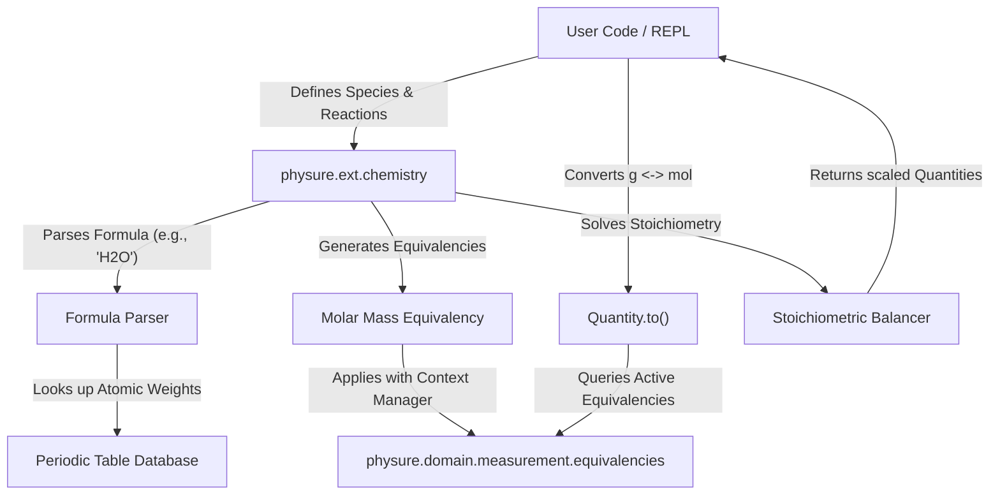

# Chemistry & Physical-Chemical Reaction Tracking Roadmap

This document outlines the roadmap, architectural design, and implementation path for introducing a **Chemistry and Physical-Chemical Reaction Tracking** extension to [Physure](file:///home/irvint/Projects/physure/README.md).

---

## 1. Executive Summary

Integrating chemical reaction and physical-chemical tracking into **Physure** is highly feasible and aligns perfectly with its philosophy as an "over-engineered homework validator" and dynamic tensor-aware engine. 

By leveraging Physure's existing [equivalency framework](file:///home/irvint/Projects/physure/physure/domain/measurement/equivalencies.py) (developed for spectral and thermodynamic dimension-crossing), we can achieve substance-aware unit conversions (e.g., converting grams of a specific compound to moles) without subclassing the core [Quantity](file:///home/irvint/Projects/physure/physure/domain/measurement/quantity.py) class or complicating the base physics engine.

### Key Value Propositions
*   **Substance-Aware Conversions:** Perform seamless conversions between mass (`g`, `kg`) and amount of substance (`mol`, `mmol`) using dynamic species-dependent molar masses.
*   **Stoichiometry & Reaction Balancing:** Define, balance, and calculate reaction yields automatically with full physical unit safety.
*   **Uncertainty Propagation:** Propagate laboratory scale uncertainties (e.g., weighing errors, molar mass uncertainty) directly through reactions to final products.
*   **Physical-Chemical Calculations:** Track gas laws ($PV=nRT$), kinetics (Arrhenius equation), and thermodynamics ($\Delta H$, $\Delta G$) with full unit safety.

---

## 2. Core Architectural Approach

A major challenge in chemical unit tracking is **substance dependency**. In physics, `g` and `mol` are incompatible dimensions. In chemistry, they are linked by a species' **molar mass** ($M_W$). 

Rather than modifying the core [Quantity](file:///home/irvint/Projects/physure/physure/domain/measurement/quantity.py) class to hold a `species` metadata field (which would pollute the high-performance tensor and JIT compilation paths), we propose a modular architecture utilizing **dynamic equivalencies** and a helper package under `physure/ext/chemistry/`.

### Interaction Diagram



---

## 3. Detailed Subsystem Design

To maintain the **zero runtime dependencies** policy and keep the **first-use import time under 0.5s**, the chemistry subsystem will reside entirely in the `physure/ext/chemistry/` package and be loaded lazily.

### 3.1. Species Representation (`species.py`)
A `Species` object represents a chemical compound or element. It parses chemical formulas, calculates their molar masses, and handles uncertainty (e.g., due to isotopic distribution).

*   **Formula Parser:** A lightweight, pure-Python parser using regular expressions to parse nested chemical formulas:
    *   Examples: `"H2O"`, `"NaCl"`, `"Ca(NO3)2"`, `"Fe3(PO4)2"`.
*   **Periodic Table Database:** A compact dictionary of IUPAC standard atomic weights with experimental uncertainties (e.g., Hydrogen: $1.008 \pm 0.0002\text{ g/mol}$).
*   **Uncertainty Integration:** The molar mass is returned as a `Quantity` with an attached `UncorrelatedUncertainty` or `CorrelatedUncertainty`.

### 3.2. Molar Equivalency (`equivalency.py`)
This ties `Species` to Physure's existing equivalency framework.
*   In SI, the base unit for Mass (`M`) is `kg`, and the base unit for Amount of Substance (`N`) is `mol`.
*   If a substance has a molar mass $M_{\text{base}}$ (in `kg/mol`), the conversion functions are:
    *   $\text{Mass (kg)} \rightarrow \text{Amount (mol)}: n = m / M_{\text{base}}$
    *   $\text{Amount (mol)} \rightarrow \text{Mass (kg)}: m = n \cdot M_{\text{base}}$

```python
def molar_equivalency(species: Species) -> EquivalencyList:
    # Get molar mass in base SI units (kg/mol)
    m_base = species.molar_mass.to("kg/mol").magnitude
    
    from physure.domain.measurement.dimensions import Dimension
    dim_mass = Dimension({"M": 1})
    dim_amount = Dimension({"N": 1})
    
    return [
        (dim_mass, dim_amount, lambda m: m / m_base, lambda n: n * m_base)
    ]
```

### 3.3. Reaction Balancing & Stoichiometry (`reaction.py`)
This represents chemical reactions and performs calculations on reactants and products.
*   **Equation Parsing:** Parses strings like `"2 H2 + O2 -> 2 H2O"`.
*   **Balancer:** Solves the linear system of elemental conservation equations to find the stoichiometric coefficients (stoichiometric matrix kernel). Since external libraries like SciPy or SymPy are optional, we implement a lightweight Gaussian elimination solver in pure Python (falling back to a compiled Rust routine in `physure_core` for complex networks).
*   **Yield & Limiting Reactant Calculations:** Given a set of input reactant `Quantity` objects, it identifies the limiting reactant, calculates the theoretical yield of products, and propagates their uncertainties automatically.

---

## 4. Key API Examples

Here is how the proposed API will look in practice, following the Physure aesthetic:

### 4.1. Substance-Aware Unit Conversion
Converting mass to moles is normally impossible because their dimensions are different. Using the molar equivalency, it becomes trivial:

```python
from physure import Q_, equivalencies
from physure.ext.chemistry import Species, molar_equivalency

# 1. Define species (which automatically computes its molar mass)
water = Species("H2O")  # Molar Mass: 18.01528 +/- 0.0005 g/mol

# 2. Define a mass Quantity
water_mass = Q_(18.015, "g", uncertainty=0.01)

# 3. Convert to moles using equivalencies
with equivalencies(molar_equivalency(water)):
    water_moles = water_mass.to("mol")

print(water_moles)
# Output: 0.99998 +/- 0.00055 mol  (propagates mass scale + molar mass error)
```

### 4.2. Chemical Reactions and Stoichiometric Uncertainty
We can define a reaction, balance it, and calculate product yield with propagated uncertainties from scale measurements.

```python
from physure import Q_
from physure.ext.chemistry import Reaction

# 1. Define and parse a chemical reaction
rxn = Reaction.from_string("2 H2 + O2 -> 2 H2O")

# 2. Define reactant inputs (with lab uncertainties)
h2_input = Q_(10.0, "g", uncertainty=0.1)
o2_input = Q_(50.0, "g", uncertainty=0.2)

# 3. Calculate yields
results = rxn.calculate(H2=h2_input, O2=o2_input)

print(f"Limiting reactant: {results.limiting_reactant}")
print(f"Theoretical water yield: {results.yields['H2O'].to('g')}")
# Output:
# Limiting reactant: O2
# Theoretical water yield: 56.31 +/- 0.23 g
```

### 4.3. Physical-Chemical Interactions: Ideal Gas Law
Since species are associated with molar masses, we can easily cross from chemical quantities to physical quantities like pressure, volume, and temperature:

```python
from physure import Q_
from physure.ext.chemistry import Species

# Ideal Gas: PV = nRT  => P = nRT/V
R = Q_(8.314462618, "J/(mol*K)") # Gas Constant

carbon_dioxide = Species("CO2")
mass = Q_(100.0, "g")
temp = Q_(25.0, "degC") # Converted to 298.15 K internally
vol = Q_(10.0, "L")

# Convert mass to moles under CO2's equivalency
with equivalencies(molar_equivalency(carbon_dioxide)):
    moles = mass.to("mol")

# Physical pressure calculation
pressure = (moles * R * temp.to("K")) / vol.to("m^3")
print(pressure.to("atm"))
# Output: 5.56 atm (perfectly verified and unit-safe!)
```

### 4.4. Kinetics: Arrhenius Equation
Verifying physical-chemical rate constants:
$$k = A \exp\left(-\frac{E_a}{R T}\right)$$

```python
import math
from physure import Q_

# Frequency factor (first-order reaction: s^-1)
A = Q_(1e13, "s^-1")
# Activation energy (J/mol)
E_a = Q_(75.0, "kJ/mol")
# Universal gas constant (J/(mol*K))
R = Q_(8.314, "J/(mol*K)")
# Temperature (K)
T = Q_(298.15, "K")

# Exponent check:
# (75000 J/mol) / (8.314 J/mol*K * 298.15 K) => Dimensionless
exponent = E_a / (R * T) # Exp evaluates to dimensionless Quantity!

k = A * math.exp(-exponent.magnitude)
print(f"Rate constant: {k}") # 0.72 s^-1
```

---

## 5. Feasibility and Constraints Analysis

| Metric/Constraint | Feasibility Rating | Mitigation Strategy |
| :--- | :--- | :--- |
| **Zero Runtime Dependencies** | 🟢 **100% Feasible** | The atomic weight database, formula parser, and reaction balancer can be written in pure Python using basic math/regex, avoiding external dependencies like `scipy` or `sympy`. |
| **First-Use Import Budget (<0.5s)** | 🟢 **100% Feasible** | Keep the chemistry code inside `physure/ext/chemistry/` and do not import it in `physure/__init__.py`. Users import it explicitly only when doing chemistry. |
| **Uncertainty Propagation** | 🟢 **100% Feasible** | Already supported natively by Physure's `equivalencies` and automatic differentiation. Works out-of-the-box. |
| **Multi-backend / JIT Compilation** | 🟡 **70% Feasible** | Equivalency conversions and chemical functions will compile fine with `torch.compile` / `jax.jit`. However, reaction *balancing* (which requires solving systems of equations) should be done at configuration time, not within dynamic trace loops. |
| **Performance Overhead** | 🟢 **90% Feasible** | Pure Python is fast enough for small chemical reactions. For complex reaction networks (e.g., combustion models), we can implement a Rust solver in `physure_core` as an optional performance boost. |

---

## 6. Recommended Phase-by-Phase Implementation Roadmap

1.  **Phase 1: Species & Atomic Mass Registry (`ext/chemistry/species.py`)**
    *   Implement IUPAC atomic mass database.
    *   Build chemical formula parser.
    *   Expose `Species` class with molecular weight calculation and uncertainty.
2.  **Phase 2: Molar Equivalency (`ext/chemistry/equivalency.py`)**
    *   Build `molar_equivalency(species)` connecting Mass (`M`) and Substance (`N`) dimensions.
    *   Add tests verifying mass-to-moles conversions with uncertainty propagation.
3.  **Phase 3: Reaction Solver & Stoichiometry (`ext/chemistry/reaction.py`)**
    *   Build reaction parser and Gaussian balancer.
    *   Build yield calculator (handling limiting reactants and stoichiometry).
4.  **Phase 4: Physical Chemistry (`ext/chemistry/thermo_kinetics.py`)**
    *   Introduce enthalpy, entropy, free energy database helpers.
    *   Provide Arrhenius, Clausius-Clapeyron, and solution properties helper functions.
