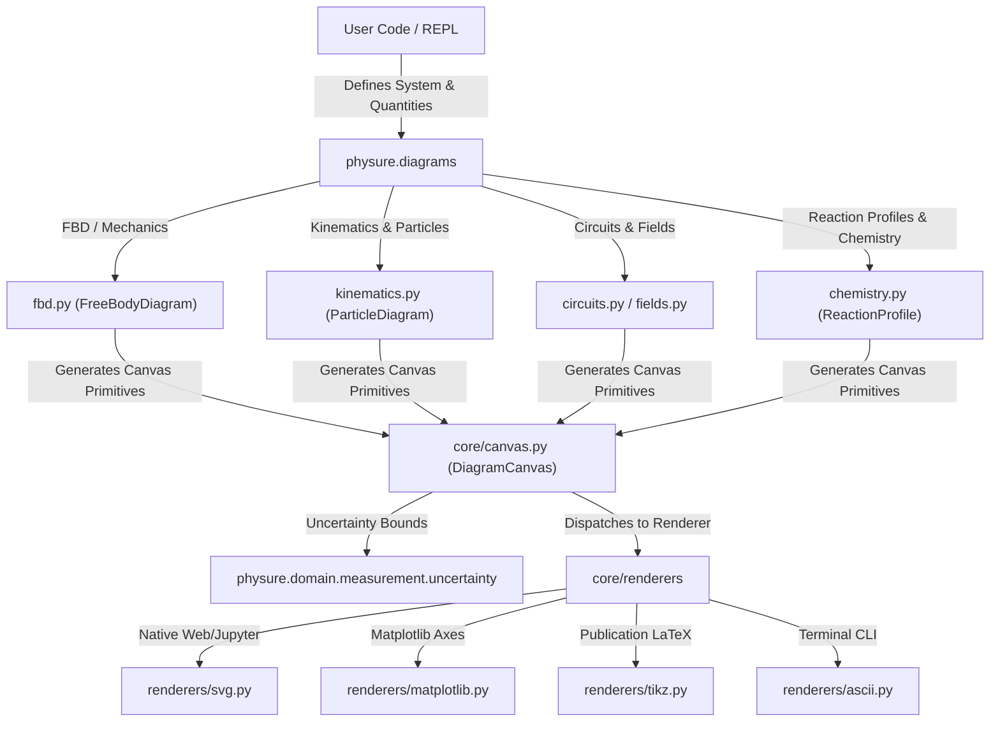
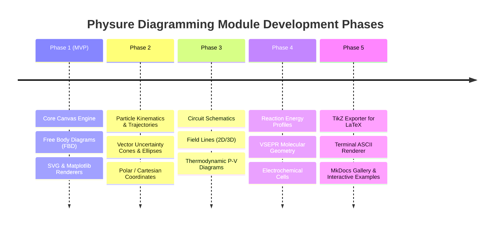

# Physical & Scientific Diagramming Engine Roadmap

This document outlines the roadmap, architectural design, and implementation path for introducing a **Parametric Physical & Scientific Diagramming Engine** (`physure.diagrams`) to [Physure](file:///home/irvint/Projects/physure/README.md).

---

## 1. Executive Summary

Integrating a parametric diagramming engine into **Physure** expands the library beyond *solving physics equations* to *visually modeling physical systems*. 

Unlike standard drawing software (e.g., Illustrator, Canva) or generic plotting libraries, diagrams in Physure are **physically parameter-driven**:
* **Live Physical Quantities:** Vectors, dimensions, angles, and forces are defined using Physure's [Quantity](file:///home/irvint/Projects/physure/physure/domain/measurement/quantity.py) objects (`Q_(50, "N")`, `Q_(30, "deg")`).
* **Proportional Scaling & Physics Consistency:** If a mass or angle changes, the diagram auto-scales and recomputes resultant vectors ($\Sigma \vec{F}$), normal forces ($\vec{N}$), and trajectories while maintaining correct physical proportions.
* **Uncertainty Visualization:** Leverages Physure's uncertainty engine to render **error cones** around vectors and **covariance ellipses** around particle positions.
* **Multi-Backend Rendering:** Exports cleanly to standalone **SVG**, **Matplotlib** (integrating with [plotting.py](file:///home/irvint/Projects/physure/physure/plotting.py)), **Plotly**, **LaTeX (TikZ)** for academic papers, and **ASCII/Unicode** for terminal CLI previsualization.

---

## 2. Core Architectural Approach

To respect Physure's non-negotiable invariants (**zero mandatory runtime dependencies** and **fast startup time under 0.5s**), the diagramming module will reside lazily under `physure/diagrams/`. Heavy visualization libraries (Matplotlib, Plotly) are imported only on demand.

### System Architecture Diagram



---

## 3. Subsystem & Module Design

### 3.1. Core Canvas & Primitives (`physure/diagrams/core/`)
Provides the foundational coordinate system and physical vector primitives:
* **`DiagramCanvas`:** A physical 2D/3D workspace operating in real physical units (meters, newtons, degrees) rather than arbitrary pixel values.
* **`Vector2D` / `Vector3D`:** Represents directional physical quantities ($\vec{F}, \vec{v}, \vec{a}, \vec{r}$) with origin, magnitude, direction, label, and error bounds.
* **`RenderStyle`:** Centralized modern color palette (Indigo `#4F46E5`, Teal `#0D9488`, Rose `#E11D48`), customizable line weights, arrowheads, and light/dark theme support.

### 3.2. Free Body Diagrams (FBD) (`fbd.py`)
Provides automated and manual force vector placement for classical mechanics:
* **Surface Geometries:** Horizontal planes, vertical walls, and **inclined planes** with configurable incline angle $\theta$.
* **Automatic Force Generation:**
  * Weight vector ($\vec{W} = m\vec{g}$) pointing downward.
  * Normal force ($\vec{N}$) perpendicular to contact surface.
  * Static & Kinetic friction ($\vec{f}_s, \vec{f}_k$) opposing motion.
  * Tension vectors ($\vec{T}$) along ropes/cables.
* **Resultant & Projections:** Calculates and optionally draws net force $\Sigma \vec{F}$ or component breakdowns along incline axes ($F_x, F_y$).

### 3.3. Particle Kinematics & Trajectories (`kinematics.py`)
Models particle motion and coordinate systems:
* **Kinematic Vectors:** Position $\vec{r}(t)$, velocity $\vec{v}(t)$, and acceleration $\vec{a}(t)$.
* **Decomposition:** Tangential ($a_t$) and normal ($a_n$) components for curvilinear motion.
* **Coordinate Systems:** Cartesian $(x,y)$, Polar $(r, \theta)$, and Cylindrical $(r, \theta, z)$.
* **Collisions & Trajectories:** 2D trajectory path drawing with pre- and post-collision velocity vectors.

### 3.4. Vector Uncertainty Visualization (`uncertainty_viz.py`)
Leverages Physure's core uncertainty engine:
* **Directional Error Cones:** Renders shaded angular cones at vector arrowheads when angle or magnitude includes uncertainty (e.g., $30^\circ \pm 1.5^\circ$).
* **Positional Covariance Ellipses:** Draws 2D $1\sigma, 2\sigma$ spatial probability confidence regions for particle coordinates backed by `CovarianceStore`.

### 3.5. Circuits, Field Lines & Thermodynamics (`circuits.py`, `fields.py`, `thermo.py`)
* **Circuit Schematics:** Draw resistors ($R$), capacitors ($C$), inductors ($L$), and power sources ($V, I$) with automatic unit annotations.
* **Vector Fields & Field Lines:** Electric field lines for point charges/dipoles and magnetic field force vectors ($\vec{F}_B = q\vec{v} \times \vec{B}$) using 3D Right-Hand Rule indicators.
* **Thermodynamic Processes:** Interactive $P-V$, $T-S$, and $P-T$ diagrams with automatic shaded work integrals ($W = \int P \, dV$).

### 3.6. Chemistry & Physical-Chemical Diagrams (`chemistry.py`)
Integrates with the [Chemistry Roadmap](file:///home/irvint/Projects/physure/docs/chemistry_roadmap.md):
* **Reaction Energy Profiles:** Activation energy ($E_a$), reactants, transition state (activated complex), and enthalpy change ($\Delta H$) for exothermic/endothermic reactions.
* **VSEPR Molecular Geometry:** 2D/3D geometry representation (linear, trigonal planar, tetrahedral, octahedral) with bond angle annotations.
* **Electrochemical Cells:** Voltaic/electrolytic cell diagrams showing anode, cathode, electron flow ($e^-$), and cell potential ($E^\circ$).

---

## 4. Multi-Backend Rendering Architecture

| Backend | File | Primary Use Case | Features |
| :--- | :--- | :--- | :--- |
| **SVG (Native)** | `renderers/svg.py` | Web, Jupyter Notebooks, HTML reports | Zero dependencies, crisp vector scaling, interactive tooltips |
| **Matplotlib** | `renderers/matplotlib.py` | Python scripts, publication figures | Integrates with [physure.plotting](file:///home/irvint/Projects/physure/physure/plotting.py) |
| **Plotly** | `renderers/plotly.py` | Interactive 3D visualization | 3D field lines, interactive rotations |
| **TikZ (LaTeX)** | `renderers/tikz.py` | Overleaf, LaTeX academic papers | Generates clean native TikZ code (`\draw`, `\node`) |
| **ASCII / Console** | `renderers/ascii.py` | Terminal CLI REPL | Instant terminal preview (`python -m physure`) |

---

## 5. Phased Implementation Roadmap



### Milestone Breakdown

- [ ] **Phase 1: MVP Core & Free Body Diagrams**
  - [ ] Implement `physure/diagrams/core/canvas.py` and primitives (`Vector2D`, `Point2D`).
  - [ ] Implement `FreeBodyDiagram` in `fbd.py` supporting inclined planes, weight, normal, friction, and tension.
  - [ ] Implement native `SVGRenderer` and `MatplotlibRenderer`.
  - [ ] Unit tests for FBD geometry, vector resultant calculations, and rendering output.

- [ ] **Phase 2: Particle Kinematics & Uncertainty Visualization**
  - [ ] Implement `ParticleDiagram` in `kinematics.py`.
  - [ ] Add coordinate system transforms (Cartesian $\leftrightarrow$ Polar).
  - [ ] Implement vector uncertainty error cones and position covariance ellipses.

- [ ] **Phase 3: Circuits, Field Lines & Thermodynamics**
  - [ ] Implement schematic layout engine for electrical circuits in `circuits.py`.
  - [ ] Add 2D electric/magnetic field line tracing in `fields.py`.
  - [ ] Implement $P-V$ thermodynamic state process curves with shaded work areas in `thermo.py`.

- [ ] **Phase 4: Chemistry & Physical-Chemical Diagrams**
  - [ ] Implement reaction energy profile builder in `chemistry.py`.
  - [ ] Implement VSEPR 2D/3D molecular geometries.
  - [ ] Implement electrochemical cell schematics.

- [ ] **Phase 5: TikZ Exporter, ASCII Renderer & Documentation**
  - [ ] Implement `TikZRenderer` (`to_tikz()`) for LaTeX export.
  - [ ] Implement `ASCIIRenderer` for terminal CLI REPL preview.
  - [ ] Add comprehensive MkDocs documentation and interactive tutorial gallery.

---

## 6. API Usage Specifications & Code Examples

### 6.1. Free Body Diagram on an Inclined Plane

```python
from physure import Q_
from physure.diagrams import FreeBodyDiagram

# Initialize FBD on a 30-degree inclined plane
fbd = FreeBodyDiagram(title="Block on Inclined Plane")
fbd.set_inclined_plane(angle=Q_(30, "deg"))

# Define physical parameters
mass = Q_(10, "kg")
gravity = Q_(9.81, "m/s^2", uncertainty=0.02)

# Attach forces (automatically calculated and scaled)
fbd.add_weight(mass=mass, gravity=gravity)
fbd.add_normal_force()
fbd.add_friction(mu_k=0.20)
fbd.add_force(name="P", magnitude=Q_(80, "N", uncertainty=2.5), angle=Q_(0, "deg"), relative_to="plane")

# Render interactively in Jupyter / SVG
fbd.show()

# Export native LaTeX TikZ code
fbd.to_tikz("inclined_plane_fbd.tex")
```

### 6.2. Particle Trajectory with Uncertainty Cones

```python
from physure import Q_
from physure.diagrams import ParticleDiagram

diagram = ParticleDiagram(title="Projectile Motion with Wind Drag")

# Define particle state
v0 = Q_(25, "m/s", uncertainty=0.5)
angle0 = Q_(45, "deg", uncertainty=1.0)

particle = diagram.add_particle(mass=Q_(0.5, "kg"), position=(Q_(0, "m"), Q_(0, "m")))
particle.add_velocity(magnitude=v0, angle=angle0) # Generates uncertainty cone

# Plot trajectory with confidence bands
diagram.show(show_uncertainty=True)
```
