# physure — workspace architecture

Verified against the actual tree (not `CLAUDE.md`, which still references a
stale `physure/` / `physure_core/` layout — the real crates are
`physure-core`, `physure-script`, `physure-python`, `physure-cli`,
`physure-lsp`, `physure-java`, `physure-wasm`). Two hard rules enforced by
the Rust manifests drive everything below:

- **`physure-core` has zero FFI dependencies** (`Cargo.toml`: *"MUST NOT
  depend on pyo3, wasm-bindgen, or jni ... single source of truth for all
  physics logic"*). Every language binding wraps it, never re-implements it.
- **`physure-python`'s Rust crate is PyO3-only** (*"This crate ONLY contains
  PyO3 bindings. No physics logic lives here. All math is delegated to
  physure-core."*). The compiled `.so` is literally named `physure._core`.

```mermaid
flowchart TD

subgraph group_workspace["Cargo workspace root — orchestrator"]
  node_workspace["Cargo.toml<br/>shared version/profile<br/>7 members"]
end

subgraph group_core["physure-core — pure Rust physics engine<br/>(crate physure_core, rlib, NO pyo3/wasm/jni deps)"]
  node_core{{"lib.rs · quantity.rs · equation.rs<br/>Quantity/Equation core types<br/>[lib.rs]"}}
  node_units["units/<br/>RationalUnit, UnitRegistry, .conf parsing<br/>[units/mod.rs]"]
  node_math["math/<br/>dual numbers, Hessian propagation,<br/>interval arithmetic, sparse kernels<br/>[math/mod.rs]"]
  node_covariance[("covariance/<br/>CovarianceStore, PruningConfig<br/>[covariance/store.rs]")]
  node_uncertainty["uncertainty/<br/>gaussian, unscented, monte-carlo,<br/>moments, lineage, mode<br/>[uncertainty/mod.rs]"]
  node_serialization["serialization.rs + covariance/arrow.rs<br/>Arrow interchange<br/>[serialization.rs]"]
  node_linalgplot["linalg.rs · plotting.rs<br/>matrix helpers, plot data prep"]
end

subgraph group_script["physure-script — PhysureScript (PHS) language engine<br/>depends on physure-core"]
  node_phs_engine{{"lexer.rs · parser.rs · ast.rs ·<br/>resolver.rs · interpreter.rs<br/>PhsLexer/PhsParser/PhsInterpreter/eval_phs<br/>[interpreter.rs]"}}
  node_codegen["codegen/<br/>transpile to python.rs, java.rs, rust.rs<br/>[codegen/mod.rs]"]
  node_symbolic_cas["symbolic/<br/>CAS: diff, integrate, solve,<br/>series, ode, factor, sym_matrix<br/>[symbolic/mod.rs]"]
  node_plugin["plugin.rs · builtins.rs · value.rs<br/>native plugin ABI, PhsValue<br/>[plugin.rs]"]
end

subgraph group_pyo3["physure-python Rust crate — PyO3 thin wrapper<br/>(cdylib -> compiled as physure._core)"]
  node_pyo3["src/lib.rs<br/>ONLY bindings, zero physics logic<br/>[lib.rs]"]
end

subgraph group_python["physure-python/physure/ — pure Python public API package"]
  node_python_entry["__init__.py · __main__.py · cli.py<br/>public surface, sync-types/repl subcommands<br/>[__init__.py]"]
  node_repl["repl.py<br/>PHS REPL (python -m physure) —<br/>the ONE feature with no Python fallback<br/>[repl.py]"]
  node_app["application/<br/>Q_ factory, ContextVar, .conf bootstrap,<br/>fit/solver services<br/>[application/factories.py]"]
  node_measurement["domain/measurement/<br/>Quantity, UnitSystem, Uncertainty,<br/>conversions/converters<br/>[domain/measurement/quantity.py]"]
  node_symbolic_py["domain/symbolic/<br/>sympy-backed SymbolicQuantity/graph<br/>[domain/symbolic/graph.py]"]
  node_core_infra["core/<br/>BackendManager dispatcher, BackendOps<br/>protocol, lazy UnitRegistry, formatting<br/>[core/dispatcher.py]"]
  node_backends["backends/<br/>numpy/torch/jax/python/core backends<br/>[backends/core_backend.py]"]
  node_jit["_jit/tracer.py<br/>TracerQuantity DAG, validates dims<br/>via RationalUnit, zero runtime overhead<br/>[_jit/tracer.py]"]
  node_infra_conf["infrastructure/config/<br/>physure.conf, international.conf,<br/>imperial.conf<br/>[infrastructure/config/physure.conf]"]
  node_ext["ext/<br/>chemistry, pandas/numba support,<br/>phs_loader, currency (lazy-imported)<br/>[ext/phs_loader.py]"]
  node_nn["nn/<br/>unit-aware layers/loss wrapping torch.nn<br/>[nn/layers.py]"]
  node_units_pkg["units/<br/>friendly constant/unit shortcuts<br/>[units/core.py]"]
end

subgraph group_cli["physure-cli — standalone `phs` binary<br/>depends directly on physure-script (no Python)"]
  node_phs_cli{{"main.rs · step.rs · protocol.rs · config.rs<br/>phs script.phs / phs --repl<br/>[main.rs]"}}
  node_cli_render["tui.rs · web.rs · html.rs · latex.rs ·<br/>katex_assets.rs · rich.rs · scaffold.rs<br/>notebook-style rendering + project scaffolding<br/>[tui.rs]"]
end

subgraph group_lsp["physure-lsp — PHS language server<br/>(tower-lsp), depends on physure-script"]
  node_lsp["main.rs<br/>completion, diagnostics, doc sync<br/>[main.rs]"]
end

subgraph group_java["physure-java — JNI bridge<br/>depends on physure-core"]
  node_jni_rust["src/lib.rs<br/>JNI glue<br/>[lib.rs]"]
  node_java_api["java/com/physure/*.java<br/>NativeEngine, Quantity, PhyEquation,<br/>QuantityMatrix/Vector, UnitRegistry<br/>[NativeEngine.java]"]
end

subgraph group_wasm["physure-wasm — wasm-bindgen bridge<br/>(cdylib, depends on physure-core + physure-script,<br/>published to npm as `physure`)"]
  node_wasm["lib.rs · quantity.rs · registry.rs ·<br/>phy_function.rs · error.rs<br/>Quantity/UnitRegistry/PhyFunction JS/TS bindings<br/>[lib.rs]"]
end

node_workspace -->|"builds"| node_core
node_workspace -->|"builds"| node_phs_engine
node_workspace -->|"builds"| node_pyo3
node_workspace -->|"builds"| node_phs_cli
node_workspace -->|"builds"| node_lsp
node_workspace -->|"builds"| node_jni_rust
node_workspace -->|"builds"| node_wasm

node_core -->|"implements"| node_units
node_core -->|"uses"| node_math
node_core -->|"propagates through"| node_uncertainty
node_uncertainty -->|"tracks correlations in"| node_covariance
node_covariance -->|"(de)serializes via"| node_serialization
node_core -->|"exposes"| node_linalgplot

node_phs_engine -->|"workspace dep: shares physics types"| node_core
node_phs_engine -->|"transpiles to targets"| node_codegen
node_phs_engine -->|"computes with"| node_symbolic_cas
node_phs_engine -->|"loads native plugins via"| node_plugin

node_pyo3 -->|"delegates ALL physics math to"| node_core
node_pyo3 -->|"delegates PHS parsing/eval to"| node_phs_engine
node_pyo3 -.->|"compiled artifact imported as physure._core"| node_python_entry

node_python_entry -->|"initializes"| node_app
node_app -->|"parses .conf into UnitSystem"| node_infra_conf
node_app -->|"constructs"| node_measurement
node_measurement -->|"dispatches array/tensor ops"| node_core_infra
node_core_infra -->|"lazily loads"| node_backends
node_measurement -.->|"correlated mode backed by native"| node_pyo3
node_jit -.->|"validates dimensions via native"| node_pyo3
node_repl -->|"requires (no Python fallback)"| node_pyo3
node_ext -.->|"optional lazy import"| node_measurement
node_ext -.->|"optional lazy import"| node_backends
node_ext -->|"executes .phs scripts via native"| node_pyo3
node_nn -->|"wraps"| node_backends
node_symbolic_py -.->|"optional sympy dependency"| node_measurement
node_units_pkg -->|"registers into"| node_core_infra

node_phs_cli -->|"depends on"| node_phs_engine
node_cli_render -->|"renders output for"| node_phs_cli
node_lsp -->|"depends on"| node_phs_engine
node_jni_rust -->|"delegates to"| node_core
node_java_api -->|"calls via JNI"| node_jni_rust

node_wasm -->|"delegates physics math to"| node_core
node_wasm -->|"embeds PHS interpreter from"| node_phs_engine

click node_workspace "https://github.com/Alexisrx96/physure/blob/main/Cargo.toml"
click node_core "https://github.com/Alexisrx96/physure/blob/main/physure-core/src/lib.rs"
click node_units "https://github.com/Alexisrx96/physure/blob/main/physure-core/src/units/mod.rs"
click node_math "https://github.com/Alexisrx96/physure/blob/main/physure-core/src/math/mod.rs"
click node_covariance "https://github.com/Alexisrx96/physure/blob/main/physure-core/src/covariance/store.rs"
click node_uncertainty "https://github.com/Alexisrx96/physure/blob/main/physure-core/src/uncertainty/mod.rs"
click node_serialization "https://github.com/Alexisrx96/physure/blob/main/physure-core/src/serialization.rs"
click node_linalgplot "https://github.com/Alexisrx96/physure/blob/main/physure-core/src/linalg.rs"
click node_phs_engine "https://github.com/Alexisrx96/physure/blob/main/physure-script/src/interpreter.rs"
click node_codegen "https://github.com/Alexisrx96/physure/blob/main/physure-script/src/codegen/mod.rs"
click node_symbolic_cas "https://github.com/Alexisrx96/physure/blob/main/physure-script/src/symbolic/mod.rs"
click node_plugin "https://github.com/Alexisrx96/physure/blob/main/physure-script/src/plugin.rs"
click node_pyo3 "https://github.com/Alexisrx96/physure/blob/main/physure-python/src/lib.rs"
click node_python_entry "https://github.com/Alexisrx96/physure/blob/main/physure-python/physure/__init__.py"
click node_repl "https://github.com/Alexisrx96/physure/blob/main/physure-python/physure/repl.py"
click node_app "https://github.com/Alexisrx96/physure/blob/main/physure-python/physure/application/factories.py"
click node_measurement "https://github.com/Alexisrx96/physure/blob/main/physure-python/physure/domain/measurement/quantity.py"
click node_symbolic_py "https://github.com/Alexisrx96/physure/blob/main/physure-python/physure/domain/symbolic/graph.py"
click node_core_infra "https://github.com/Alexisrx96/physure/blob/main/physure-python/physure/core/dispatcher.py"
click node_backends "https://github.com/Alexisrx96/physure/blob/main/physure-python/physure/backends/core_backend.py"
click node_jit "https://github.com/Alexisrx96/physure/blob/main/physure-python/physure/_jit/tracer.py"
click node_infra_conf "https://github.com/Alexisrx96/physure/blob/main/physure-python/physure/infrastructure/config/physure.conf"
click node_ext "https://github.com/Alexisrx96/physure/blob/main/physure-python/physure/ext/phs_loader.py"
click node_nn "https://github.com/Alexisrx96/physure/blob/main/physure-python/physure/nn/layers.py"
click node_units_pkg "https://github.com/Alexisrx96/physure/blob/main/physure-python/physure/units/core.py"
click node_phs_cli "https://github.com/Alexisrx96/physure/blob/main/physure-cli/src/main.rs"
click node_cli_render "https://github.com/Alexisrx96/physure/blob/main/physure-cli/src/tui.rs"
click node_lsp "https://github.com/Alexisrx96/physure/blob/main/physure-lsp/src/main.rs"
click node_jni_rust "https://github.com/Alexisrx96/physure/blob/main/physure-java/src/lib.rs"
click node_java_api "https://github.com/Alexisrx96/physure/blob/main/physure-java/src/main/java/com/physure/NativeEngine.java"
click node_wasm "https://github.com/Alexisrx96/physure/blob/main/physure-wasm/src/lib.rs"

classDef toneNeutral fill:#f8fafc,stroke:#334155,stroke-width:1.5px,color:#0f172a
classDef toneBlue fill:#dbeafe,stroke:#2563eb,stroke-width:1.5px,color:#172554
classDef toneMint fill:#dcfce7,stroke:#16a34a,stroke-width:1.5px,color:#14532d
classDef toneIndigo fill:#e0e7ff,stroke:#4f46e5,stroke-width:1.5px,color:#312e81
classDef toneAmber fill:#fef3c7,stroke:#d97706,stroke-width:1.5px,color:#78350f
classDef toneTeal fill:#ccfbf1,stroke:#0f766e,stroke-width:1.5px,color:#134e4a
classDef toneRose fill:#ffe4e6,stroke:#e11d48,stroke-width:1.5px,color:#881337
classDef tonePurple fill:#f3e8ff,stroke:#9333ea,stroke-width:1.5px,color:#581c87
classDef toneCyan fill:#cffafe,stroke:#0891b2,stroke-width:1.5px,color:#164e63

class node_core,node_units,node_math,node_covariance,node_uncertainty,node_serialization,node_linalgplot toneBlue
class node_phs_engine,node_codegen,node_symbolic_cas,node_plugin toneMint
class node_pyo3 toneIndigo
class node_python_entry,node_repl,node_app,node_measurement,node_symbolic_py,node_core_infra,node_backends,node_jit,node_infra_conf,node_ext,node_nn,node_units_pkg toneAmber
class node_phs_cli,node_cli_render toneTeal
class node_lsp toneRose
class node_jni_rust,node_java_api tonePurple
class node_wasm toneCyan
class node_workspace toneNeutral
```

## Layer responsibilities

| Group | Purpose | Key rule |
|---|---|---|
| **physure-core** | Single source of truth for all physics: dimensional analysis (`units/`), numeric primitives — dual numbers, interval arithmetic, sparse Jacobians (`math/`), sparse covariance tracking (`covariance/`), and the propagation models — Gaussian, unscented, Monte Carlo (`uncertainty/`). | No FFI deps of any kind — every binding wraps this, never duplicates it. |
| **physure-script** | The PhysureScript (PHS) DSL: lexer → parser → resolver → tree-walking interpreter, a small CAS (`symbolic/`) for diff/integrate/solve, and transpilers to Python/Java/Rust (`codegen/`). Shares physics types with `physure-core`. | This is the *only* implementation of PHS — nothing reimplements it in Python. |
| **physure-python (Rust)** | PyO3 binding crate only. Compiles to `physure._core`. | Zero physics logic — pure glue over `physure-core` + `physure-script`. |
| **physure-python (Python)** | The public library: `application/` (composition root: `Q_`, active-`UnitSystem` context, `.conf` bootstrap), `domain/measurement` (`Quantity`, `UnitSystem`, `Uncertainty`), `core/` (backend dispatch, protocols, lazy unit registry), `backends/` (NumPy/Torch/JAX/pure-Python), `_jit/` (compile-time unit checking via native `RationalUnit`), `ext/` (optional chemistry/pandas/numba, lazily imported), `nn/` (unit-aware `torch.nn` wrappers). | Everything has a pure-Python fallback **except** `repl.py` (PHS evaluation), which hard-requires the native extension. |
| **physure-cli** | Standalone `phs` binary — a notebook-like runner with TUI, HTML/LaTeX/KaTeX rendering, and a local web server for PHS scripts. Talks to `physure-script` directly; no Python involved. | Independent distribution target — ships without the Python package. |
| **physure-lsp** | `tower-lsp` server giving editors completion/diagnostics for `.phs` files. | Thin — delegates all language understanding to `physure-script`. |
| **physure-java** | JNI bridge exposing `physure-core` types (`Quantity`, `UnitRegistry`, ...) to the JVM. | Mirrors the PyO3 crate's role: bindings only, no physics logic. |
| **physure-wasm** | `wasm-bindgen` crate exposing `Quantity`, `UnitRegistry`, and `PhyFunction` (PHS-defined functions) to JS/TS. Compiles to a `cdylib` and publishes to npm as the `physure` package. | Bindings only — delegates physics math to `physure-core` and embeds a `physure-script` `PhsInterpreter` for `PhyFunction` bodies. |

**Note:** `CLAUDE.md`'s architecture section describes an older `physure/` / `physure_core/` layout (with `domain/notation/` and `static/` mypy plugin dirs) that no longer exists on disk — the real paths are `physure-python/physure/*` and `physure-core/src/*` as shown above. Worth updating that doc separately.
